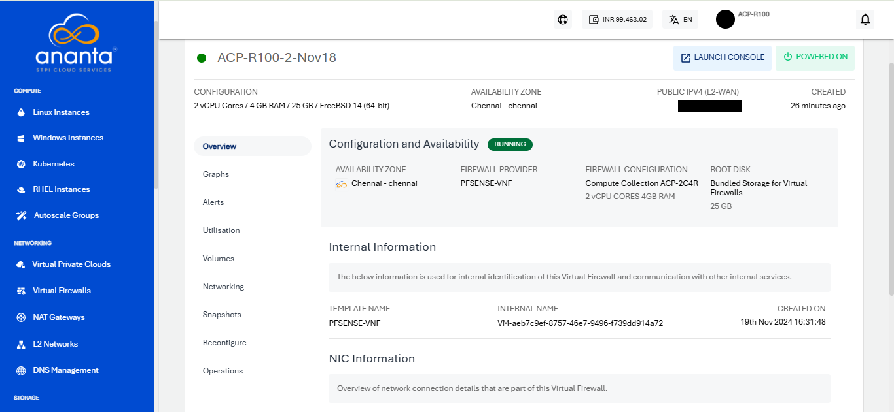

# Overview

To view the below details, navigate to the navigate to **Networking** > **Virtual Firewall**. Select the Virtual Firewall and access the **Overview** tab.
- [Configuration and Availability](#configuration-and-availability)
- [Internal Information](#internal-information)
- [NIC Information](#nic-information)  
 
## Configuration and Availability

This section displays the instance's status, **RUNNING**, is displayed in **green**, whereas STOPPED is displayed in greyed out and the information about the networking zone.
## Internal Information
This section displays the information used for internal identification of this instance and communication with other internal services.
- Template Name
- Internal Name
- Created On
## NIC Information

This section displays the following details network connection details that are part of this Virtual Firewall:
- Network Name
- MAC ADDRESS
- IP ADDRESS
- NETMASK
- GATEWAY

