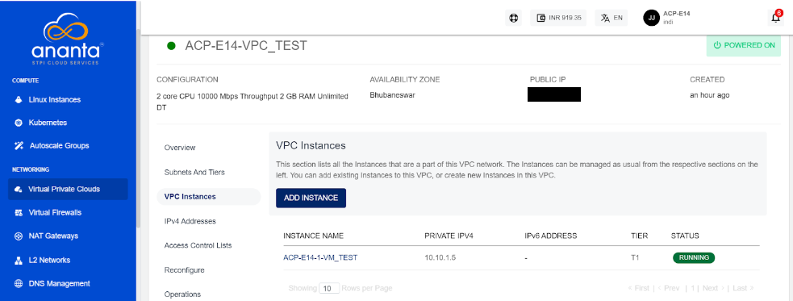

# Managing VPC Instances

## Viewing VPC Instances

Ananta Cloud Console offers a quick means to view Instances that are part of a VPC network, and to associate or dissociate Instances with VPCs. For this navigate to VPC Instance and click on it. 

## Adding (or Removing) Instances to VPC

The **ADD INSTANCE** button can be used to view all Instances that are available to add to this VPC. Since VPC allows adding multiple NIC to Instances, this means that Instances can be shared between VPC networks (and also between tiers of the same VPC), as long as the VPC networks are within the same Availability Zone.

:::note
An Instance created in any VPC/advanced Availability Zone must be attached to at least one subnet.
:::

