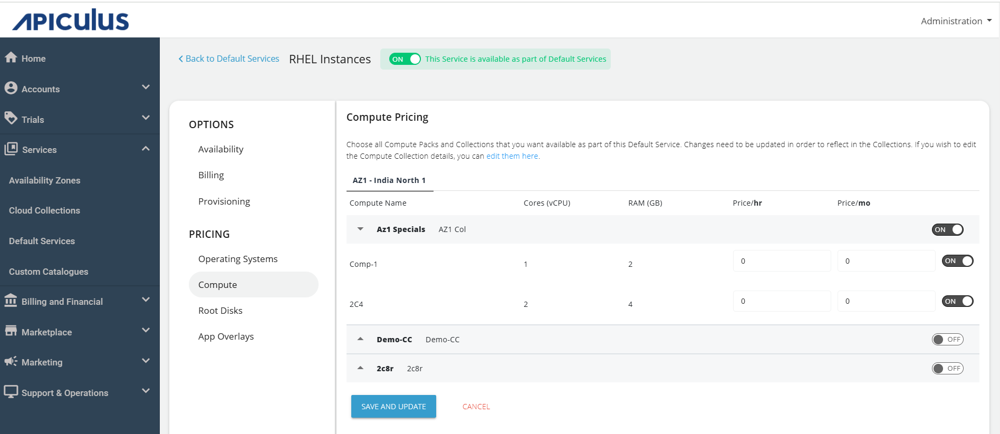

# Configuring RHEL Instances

The Red Hat Enterprise Linux (RHEL) pricing model is based on virtual CPU (vCPU) core slabs. You can configure pricing per Red Hat’s standard core model, which includes:
- 1-8 vCPUs
- 9-128 vCPUs
- 129+ vCPUs

To configure RHEL Instances, follow these steps :

1. Click **Default Services**.
2. Under the **Compute** section, click **RHEL Instances**.
   
3. Turn on the toggle button at the top to make this service available as part of the default services. This action will enable all associated sections.
4. Under the **Availability** section, select the availability zone(s) from which you want to offer the service. Then, click **Save and Update**.
   
5. In the **Billing** section, select the **Billing Options**.
	   - **Prorate on Entry** - Purchases will be pro-rated at the time of purchase of services.
	- **Prorate on Exit** - Removals will be pro-rated at the time of removal of services.
   
6. Select the **Billing Cycle** to displayed to the subscribers: **Hourly**, **Monthly**, or **Both**.
7. You can provision the RHEL Instances with an approval-based system in the **Provisioning** section. To enable this, turn on the **Approval Required** toggle button to offer additional functionalities such as sending custom instructions to end-users upon approval and attaching up to five files, each up to three MB.
8. Under the **Operating Systems** section, select the **Availability Zone**, and enable the required packs inside the collections.
	
9. In the **Compute** section, click on the **Availability Zone**, and enable the compute pack of the specific collection you want to offer to the end user.
	
10. In the **Root Disks** section, click on the **Availability Zone** and enable packs for the designated collection.
	
11. In the **App Overlays** section, select all the apps you want to provide as part of the default service to the end-users during the deployment of the RHEL instance.
	
 12. Return to Default Services, and click **PUBLISH DEFAULT CATALOGUE**.
	 

