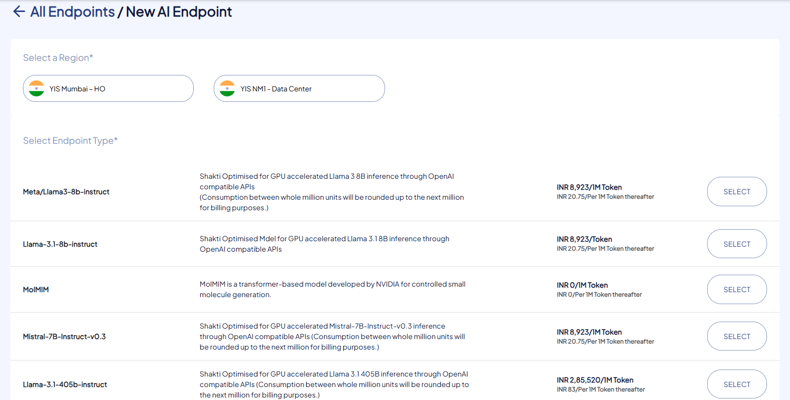
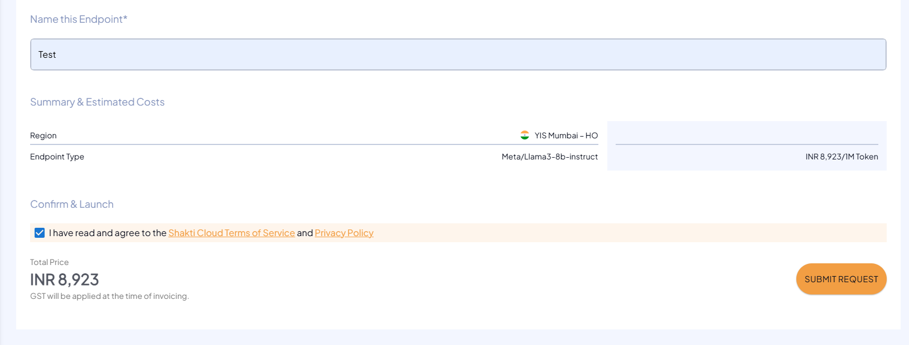

# Creating New AI Endpoints

The following are the steps to create AI Endpoints:

1. To create new AI Endpoint, click the **NEW AI ENDPOINT** button.
2. Choose the geographical region.
3. Choose the Endpoint type.
   
4. Mention the unique and valid Name of your AI Endpoint.
5. Verify the **Summary & Estimated Costs**.
6. Select the **I have read and agree to the Shakti Cloud Terms of Service** option.
7. Click **SUBMIT REQUEST**.
   
8. You get the following screen, click **CONFIRM** to Launch the resource.