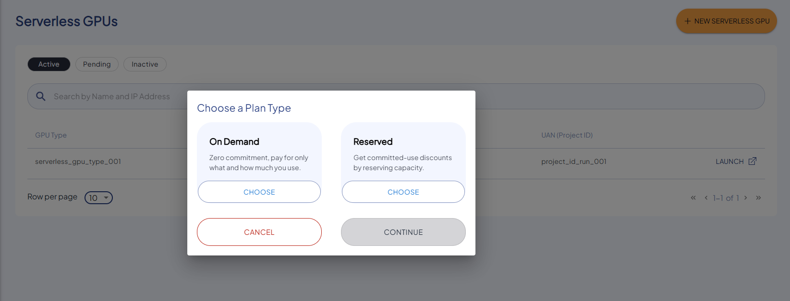
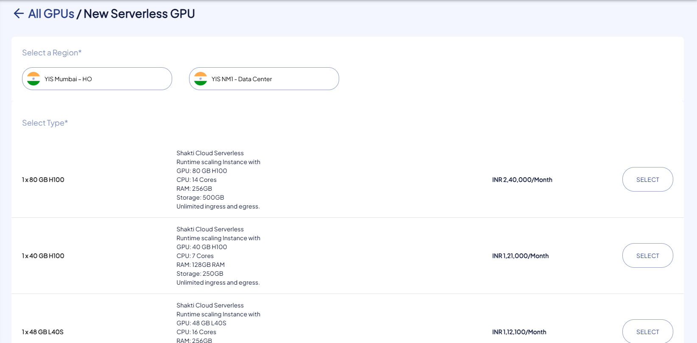
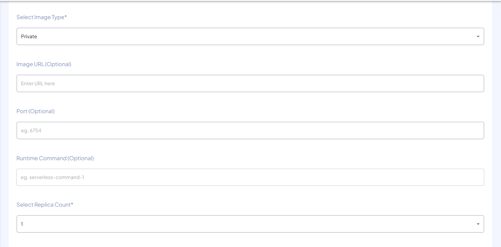
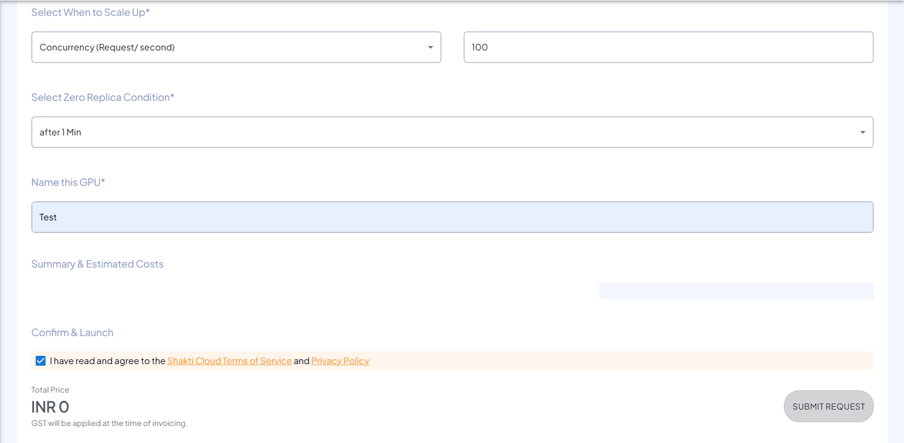

# Creating Serverless GPU

The following are the steps to create AI Endpoints:

1. To create new Serverless GPU, click the **NEW SERVERLESS GPU** button.
2. Choose a plan type that fits your usage and performance needs.
3. Select the geographical region for deploying the GPU.
4. Choose the Scaling Instance type. 
5. Select the image type for your deployment.
6. Provide the image URL if using a custom image.
7. Specify the port number for the service.
8. Enter the runtime command to be run.
9. Select the replica count.
10. Define the scaling condition.
11. Specify the zero replica condition.
12. Mention the unique and valid Name of your Serverless GPU.
13. Verify the Summary & Estimated Costs.
14. Select the **I have read and agree to the Shakti Cloud Terms of Service** option.
15. Click **SUBMIT REQUEST**.
    
16. You get the following screen, click **CONFIRM** to Launch the resource.