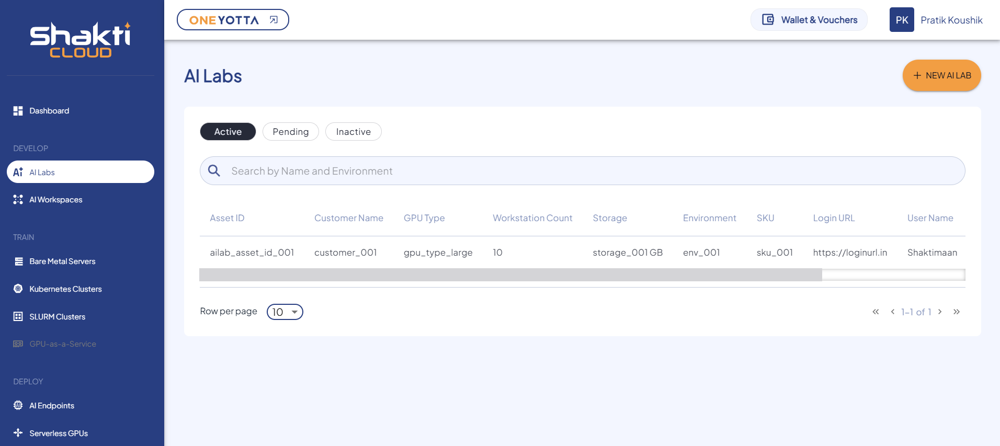

# Viewing Details of AI Lab Instances

To view the available AI Lab instances, navigate to the **AI Lab Instance** screen.  
Here, you can see the following details:

- Asset ID
- Customer Name
- GPU Type
- Workstation Count
- Storage
- Environment
- SKU
- Login URL
- User Name
- Password

The dashboard includes the following modes:
- Active
- Pending
- Inactive

