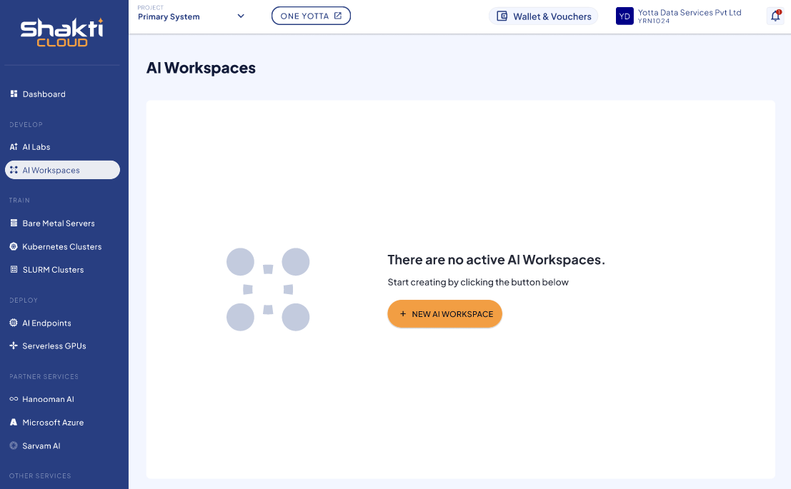
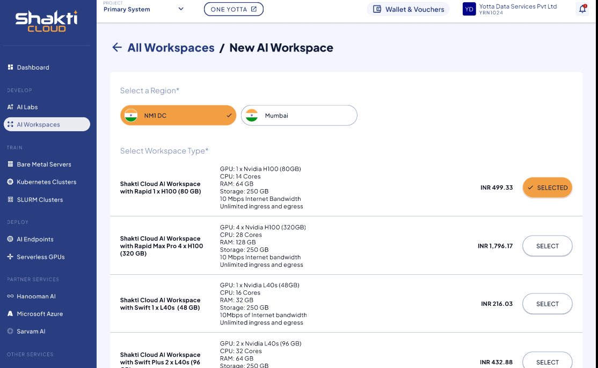
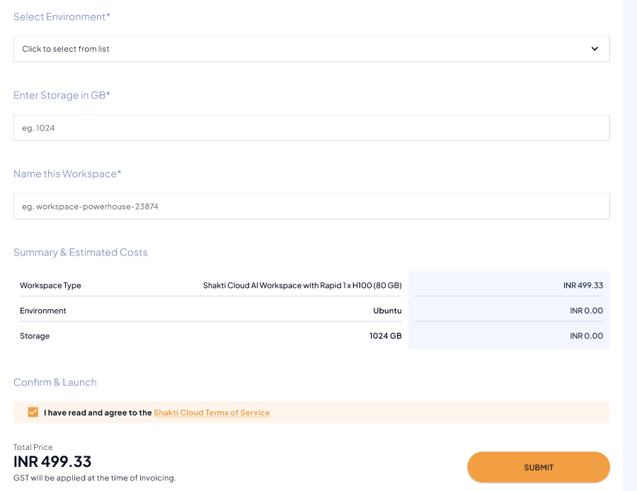
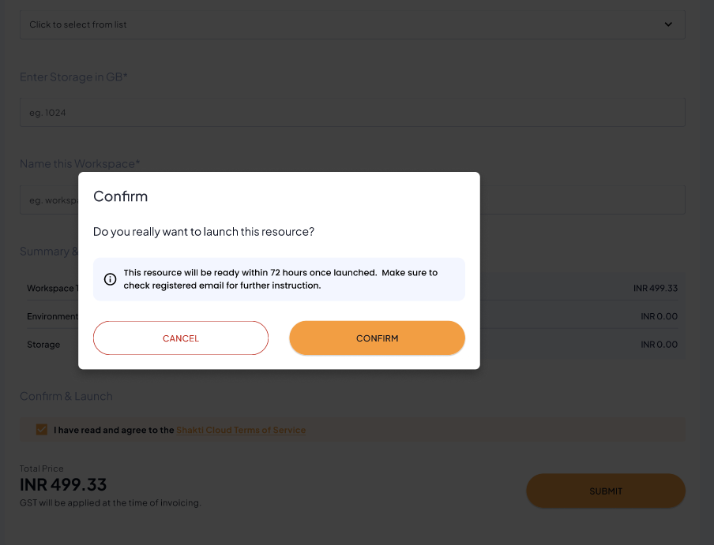

# Creating New AI Workspace

The following are the steps to create New AI Workspace:
1. To Create New AI workspace, click the **New AI workspace** button.
	
2. Select a **Region**.
3. Choose a **Workspace Type**.
	
4. Select an **Environment**.
5. Enter the required **Storage (in GB)**.
6. Provide a **unique and valid Name** for your AI Workspace.
7. Review the **Summary & Estimated Costs**.
8. Select the **I have read and agree to the Shakti Cloud Terms of Service** option.
9. Click **SUBMIT**.
	
10. On the next screen, click **CONFIRM** to launch the resource.
	
