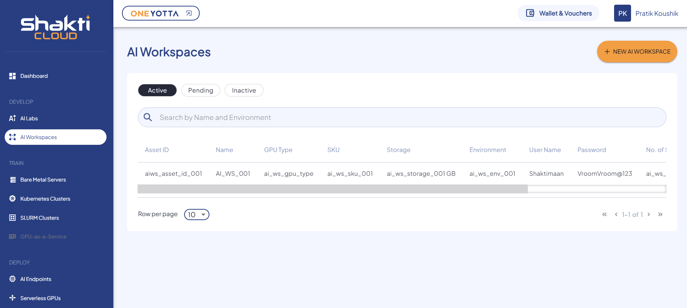

# Viewing Details of AI Workspace

To view the available AI Workspace, navigate to the **AI Workspace** screen.  
Here, you can see the following details:
- Asset ID
- Name
- GPU Type
- SKU
- Storage
- Environment
- User Name
- Password
- No. of SKUs Subscribed
- Login URL

The dashboard includes the following modes:
- Active
- Pending
- Inactive
