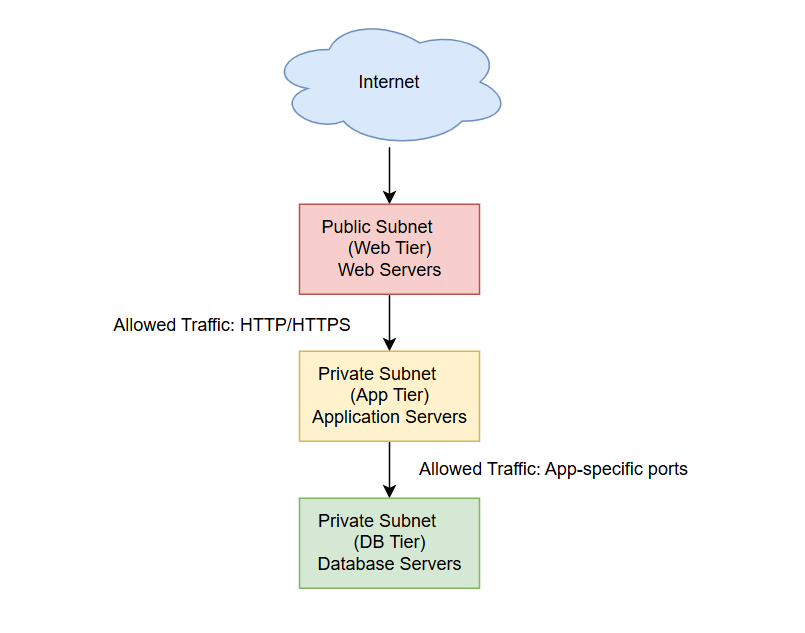

# What is IP Address, Subnet, Tier and CIDR?

 Every device or service in a network—whether it's a virtual machine, load balancer, or database—needs a unique IP address to talk to other devices. It’s like a digital address for communication. For example, a VM may be assigned `192.168.1.10`, which allows it to send and receive data across the network.

## Subnets

The IP addresses are grouped using subnets. A subnet is just a smaller section of your overall network. It helps you organize your resources into logical groups. For example, you might put all your frontend web servers in one subnet, your backend services in another, and your databases in a third. This setup allows for better control, routing, and security.

To make this structure even more useful, cloud networks usually follow a 3-tier architecture. That means resources are grouped into three main layers or tiers.

## CIDR

This brings us to **CIDR**, which stands for Classless Inter-Domain Routing. CIDR notation (like `/24`, `/16`, etc.) tells the network how many IP addresses are available in a subnet. For example, `192.168.1.0/24` means you have 256 usable IP addresses in that subnet. This system gives you flexibility to divide your network into small or large chunks, depending on how many devices you need to support.

### Super CIDR

All smaller CIDR blocks (your subnets) come from a larger pool called the **Super CIDR**. This is the main IP range assigned to your VPC. Think of it as the master bucket of IPs from which you carve out subnets. For example, if your VPC has a Super CIDR of `192.168.0.0/16`, you can create hundreds of `/24` subnets from it—each with 256 IPs for different tiers or services.

Another thing to be aware of is the **IP address classes**: Class A, B, and C. These are older ways of dividing IP ranges based on how many devices they can support.

- **Class A** addresses (e.g. `10.0.0.0`) are for very large networks and can handle millions of IPs.
- **Class B** (e.g. `172.16.0.0`) supports thousands of devices.
- **Class C** (e.g. `192.168.0.0`) is typically used in smaller networks and home/office setups.

In cloud environments, private VPCs can still use Class C ranges like `192.168.0.0/16` for smaller deployments, especially when they don’t need massive IP space.

To bring it all together, here’s a common example: You’re launching a cloud-based app. You assign a Super CIDR of `192.168.0.0/16` to your VPC. From this, you create three subnets:

- `192.168.1.0/24` for your Web Tier (public subnet)
- `192.168.2.0/24` for your App Tier (internal subnet)
- `192.168.3.0/24` for your DB Tier (private subnet)

Each tier is logically separated, secured, and scaled independently. Every resource gets an IP address, belongs to a subnet, and the network is easy to manage.