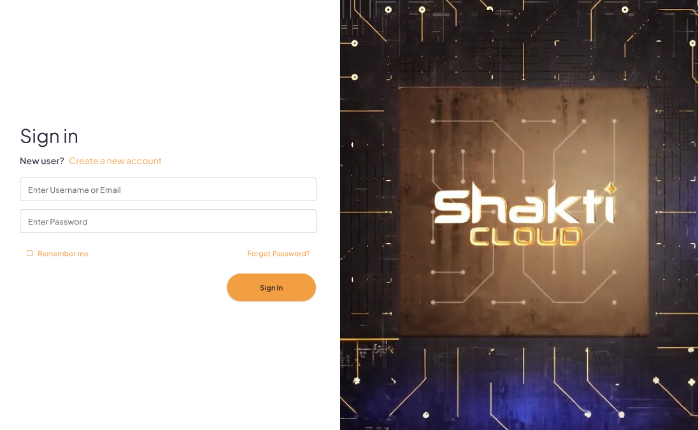
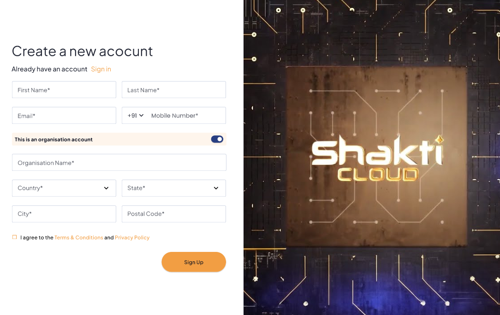
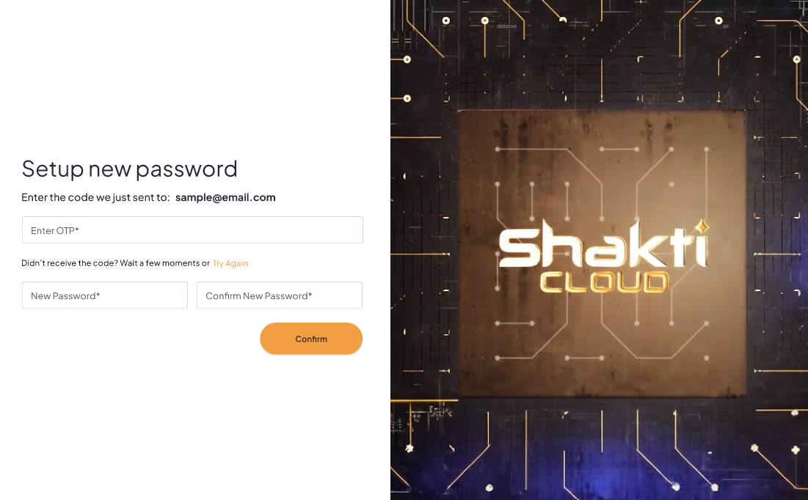

# Signing Up

Yntraa offers a a simple and user-friendly platform for creating a subscriber cloud account, enabling access to its full range of cloud services and features. Whether you're registering as an individual or on behalf of an organization, the platform ensures a seamless sign-up experience. 

The following steps to set up your account and get started with Yntraa Cloud:

1. [Sign In to Yntraa Cloud](#sign-in-to-yntraa-cloud)
2. [Create a New Account](#create-a-new-account)
3. [Password Reset](#password-reset)
### Sign In to Yntraa Cloud

To access your Yntraa Cloud account, simply enter your login credentials on the sign-in page. If you’re a new user or need to reset your password, you can use the available options before proceeding. The following steps to sign in successfully:

1. Navigate to the login page of **Yntraa Cloud**.
2. Enter your **Username or Email** and **Password** in the respective fields.
3. (Optional) Check the box for **Remember me** to stay signed in.
4. If you are a **New User**, click on **Create a new account** to register.
5. If you've forgotten your password, click **Forgot Password?** to recover it.
6. Click on the **Sign In** button to log in.

### Create a New Account

If you're new to Yntraa Cloud, you can create an account by providing your basic details and organization information (if applicable). The following steps to complete your registration:
    
 1. Fill in your **First Name** and **Last Name**.
 2. Enter your **Email Address**.
 3. Provide your **Mobile Number** (select appropriate country code).
 4. Toggle the switch if **This is an organisation account**.
 5. Fill the required details:
    - **Organisation Name**
    - **Country**
    - **State**
    - **City**
    - **Postal Code** 
 6. Agree to the **Terms & Conditions** and **Privacy Policy** by checking the box.
 7. Click on the **Sign Up** button to complete registration.

### Password Reset

If you’ve selected **Forgot Password** on the sign-in page, you can easily reset your password by the following steps outlined below:
  
  1. You’ll receive a password reset email at your registered address.
  2. Enter the **OTP** sent to your registered email (e.g., `sample@email.com`).
  3. Fill in your **New Password** and confirm it by entering it again in **Confirm New Password**.
  4. Click **Confirm** to reset your password and regain access. 

  

  
