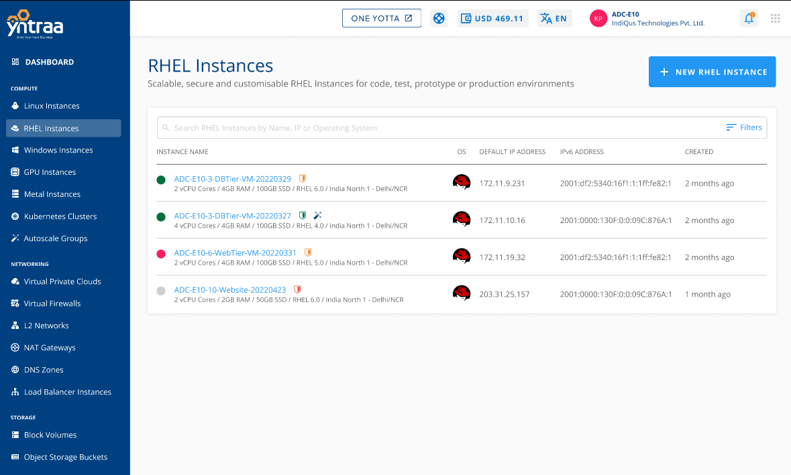

# Viewing RHEL Instances

Yntraa cloud console offers a highly usable and visual way of working with and operating RHEL Instances using the Cloud Console. All RHEL Instances available in your account can be accessed in the following way:

1. Navigate to **Compute > RHEL Instances**.
2. All the RHEL instances for your account are listed here with the following details:
	- Instance Name and the configuration details
	- OS Icon
	- Default IP Address
	- IPv6 Address
	- Created

3. To view a list of sections and the various operations or actions, click **instance name**.

Below the Instance name, there is an informational view where you can find the following details:
- Configuration
- Availability Zone
- Default IP
- Created 

Two quick options are available at the top right corner: one to Launch the Console and the other to POWER OFF/ON the Instance.
 
Details on available RHEL Instance operations and actions can be found in their respective sections:

- [Overview](docs/Subscribers/Compute/RHELInstances/Overview.md)
- [Graphs](/docs/Subscribers/Compute/RHELInstances/ViewingGraphsandUtilization#graphs)
- [Alerts](docs/Subscribers/Compute/RHELInstances/ConfiguringAlerts.md)
- [Utilisation](/docs/Subscribers/Compute/RHELInstances/ViewingGraphsandUtilization#utilisation-historical)
- [Volumes](docs/Subscribers/Compute/RHELInstances/VolumeManagement.md)
- [Networking](docs/Subscribers/Compute/RHELInstances/NetworkingManagement.md)
- [Snapshots](WorkingwithSnapshots.md)
- [Reconfigure](ReconfiguringRHELInstances.md)
- [Operations](RHELInstanceOperations.md)

