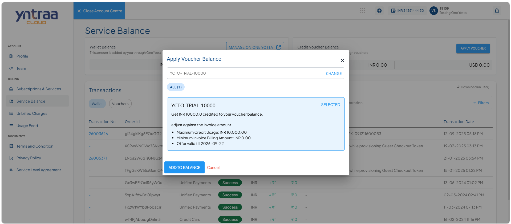
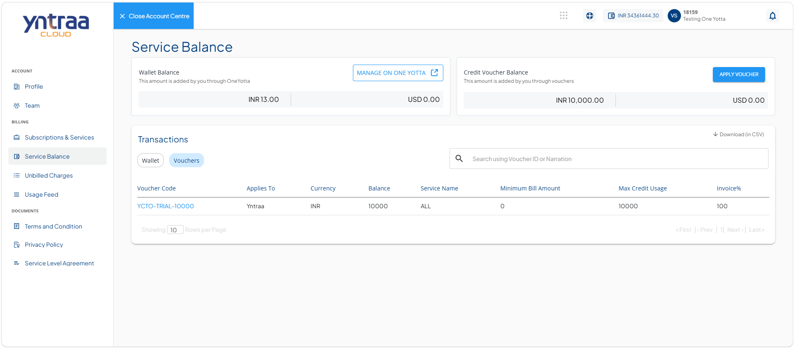

# Adding Credit Points

Applying a voucher allows you to redeem available voucher credits and add them to your service balance. Once the voucher is successfully applied, the corresponding credit points are reflected in your account balance and can be used for eligible cloud services. 

To redeem free credit points, apply a voucher balance code by following these steps:
  
  1. Navigate to [Yntraa Cloud portal](https://portal.yntraacloud.ai/).The following screen appears where you provide the required details: 
    
    - **Email**
    - **Password**.
2. Click the **Sign In** button. The following screen appears: 
   
3. Click the user profile id icon (highlighted in red). The following screen appears:
   
4. Click **Account**. The profile tab opens automatically. The following screen appears: 
   
5. Navigate to **Billing > Service Balance**. The following screen appears with the details: 
   
6. Click the **Apply Voucher** button. The following screen appears: 
   
7. Select voucher code and click the **Add to Balance** button. The following screen appears:
  
   

 

