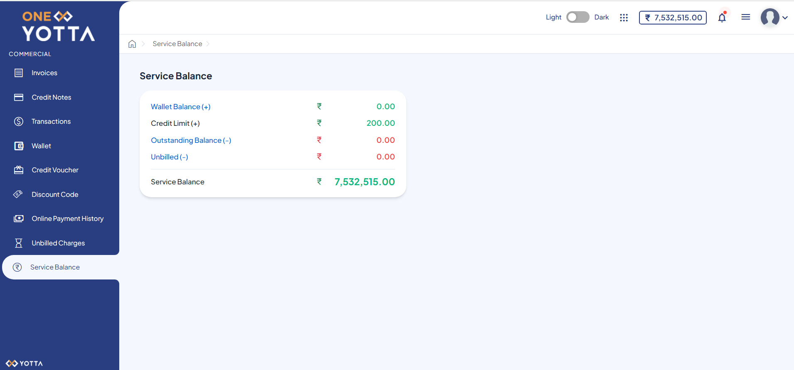

# Commercial

1. Navigate to One Yotta **Sign In** page. The following screen appears: 

2. Enter your **Email ID** and **Password** in the required fields.
3. Click on the **Sign In** button to access the dashboard. The following screen appears:

4. From the dashboard, navigate to the **Commercial** tab to view and manage commercial details:
- Invoices
- Credit Notes
- Transactions
- Wallet 
- Credit Voucher
- Discount Code
- Online Payment History
- Unbilled Charges
- Service Balance

## Invoices

1. From the dashboard, click on the **Commercial** tab from the left-side menu.
2. Under the **Commercial** section, select **Invoices**. The **Invoices** are listed in a tabular format with the following details: 
   - Invoice No 
   - Invoice Date
   - Due Date
   - Period
   - Currency
   - Total Amount
   - Amount Paid
   - Amount Due
   - Status
 3. Use the **Search Bar** to quickly find specific invoices.
 4. Click on **Choose Columns** to customize the fields displayed in the table.
 5. Click on **Excel** icon to download the invoice list.
 6. Click on **Pay Now** to proceed with invoice payment.
   
## Credit Notes

1. From the dashboard, click on the **Commercial** tab from the left-side menu.
2. Under the **Commercial** section, select **Credit Notes**. The **Credit Notes** are listed in a tabular format with the following details:
- Credit Note No.
- Invoice Ref No.
- Order Ref No.
- Credit Note Date
- Credit Note Period
- Currency
- Amount
- Status
3. Use the **Search bar** to quickly find specific credit notes.
4. Click on **Choose Columns** to customize the fields displayed in the table.
5. Use the **Excel Icon** to download the credit notes list.
6. Click on the **Download Icon** to view or download detailed credit note information.

## Transactions

1. From the dashboard, click on the **Commercial** tab from the left-side menu.
2. Under the **Commercial** section, select **Transactions**. The **Transactions** are listed in a tabular format with the following details:
- Transaction No.
- Invoice Ref No.
- Order Ref No.
- Posting Date
- Currency 
- Amount
- Type
- Mode
- Status
3. Use the **Search Bar** to quickly find specific transactions.
4. Click on **Choose Columns** to customize the fields displayed in the table.
5. Use the **Excel Icon** to download the transactions list.
  

## Wallet
1. From the left sidebar, click on **Wallet** under the **Commercial** section. The following screen appears:

At the top of the page, the Wallet Balance card displays your current available balance (for example, ₹0).

2. Click on the **+ Add Money** button on the wallet card. The following screen appears:

3. Enter the amount you want to add in the **Enter Amount** field.
4. Select the **Currency** (default is INR).
5. Select the **Apply TDS on amount** option.
6. The **TDS Amount** is auto-calculated (up to 10% of the entered amount).
7. The Net Amount (after TDS deduction) is displayed.
8. Select the **I give consent to Yotta to use my wallet balance for clearing the invoice(s) dues**.
9. Click on the **Add** button to proceed.
10. Click **Close** if you want to cancel the process.

## Credit Voucher
1. From the left sidebar, click on **Credit Voucher** under the **Commercial** section.

2. Review your **Credit Account Balance** displayed at the top.
3. Click on the **Redeem Voucher** button. The following screen appears:
   
4. **Enter Credit Voucher Code** in the input field.
5. Click on **Redeem** to apply the voucher.
6. The voucher balance updates under the Available Balance in the All section.
7. Click **Close** if you want to cancel the process.
8. Click on the **Applied Vouchers** button under the Credit Voucher section. The following screen appears, showing a table of all applied vouchers with details:
   
- Voucher Code
- Microsite
- Currency
- Amount
- Applied By
- Applied On
- Expiry On
- Status
- Services
9. Use the **Search Bar** to quickly locate a specific voucher.
10. Click on **Choose Columns**  to customize the fields displayed in the table.
11. Use the **Excel Icon** to download the voucher details.

## Discount Codes

1. From the left sidebar, click on **Discount Code** under the **Commercial** section. The **Transaction Details** are listed in a tabular format with the following details:
- Reference No.
- Discount Code
- Amount
- Type
- Currency
- Applied From
- Discount Description
- Used Amount
- Transaction Date
- Remark
2. Use the **Search Bar** to quickly locate a discount code.
3. Click on **Choose Columns**  to customize the fields displayed in the table.
4. Use the **Excel Icon** to download the discount code details.
## Online Payment History

1. From the left sidebar, click on **Online Payment History** under the **Commercial** section. The **Online Payment History** are listed in a tabular format with the following details:
- Transaction No
- Invoice No
- Payment Id
- Currency
- Payment Method
- Amount
- Wallet Amount
- TDS Amount
- Date
2. Use the **Search Bar** to quickly locate online payment.
3. Click on **Choose Columns** to customize the fields displayed in the table.
4. Use the **Excel Icon** to download the payment history details.

## Unbilled Charges

1. From the left sidebar, click on **Unbilled Charges** under the **Commercial** section. The **Unbilled Charges** are listed in a tabular format with the following details:
- Order No.
- Order Line Number
- Product Line
- Product Description
- Last Invoice Period
- Monthly Charges
- Unbilled As On Date
- Currency
2. Use the **Search Bar** to quickly locate online payment.
3. Click on **Choose Columns** to customize the fields displayed in the table.
4. Use the **Excel Icon** to download the payment history details.

## Service Balance

1. From the left sidebar, click on **Service Balance** under the **Commercial** section. The **Service Balance** are listed with the following details:
- Wallet Balance (+)
- Credit Limit (+)
- Outstanding Balance (-)
- Unbilled (-) 
- Service Balance

 

