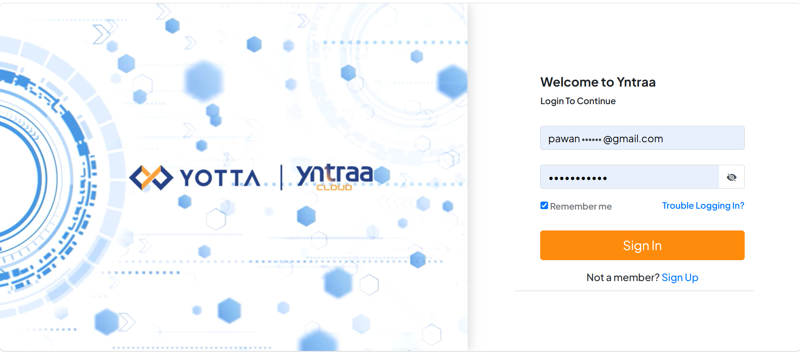
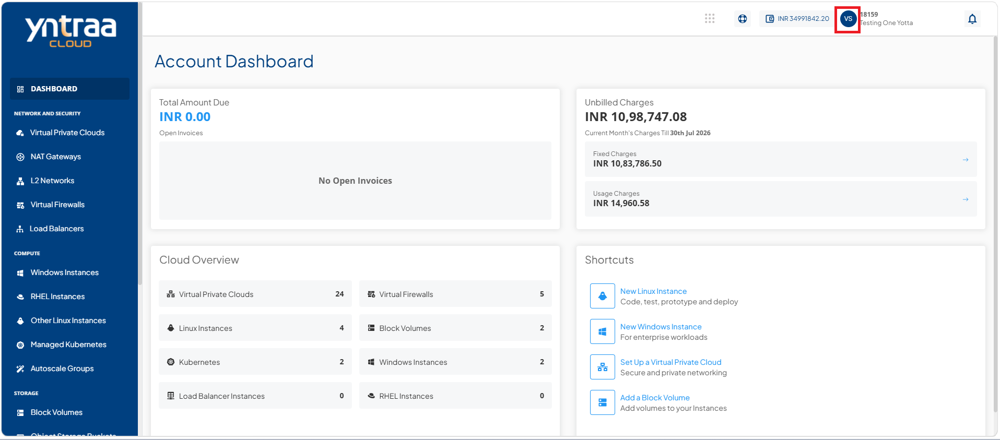
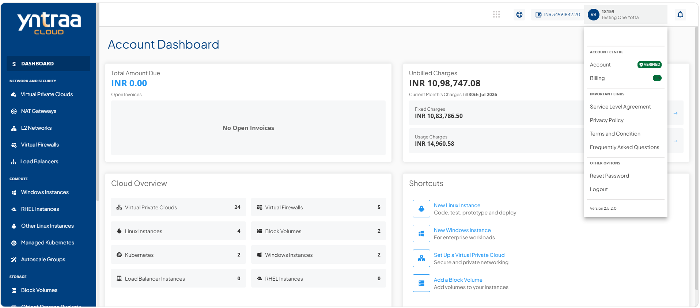
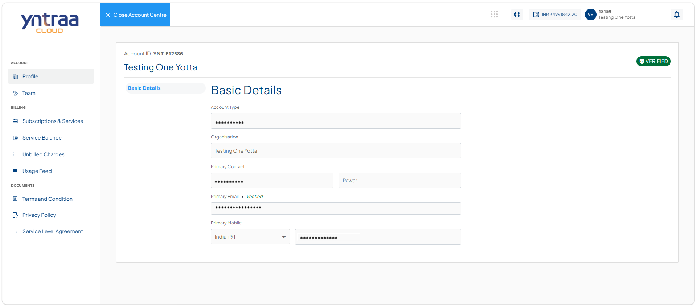
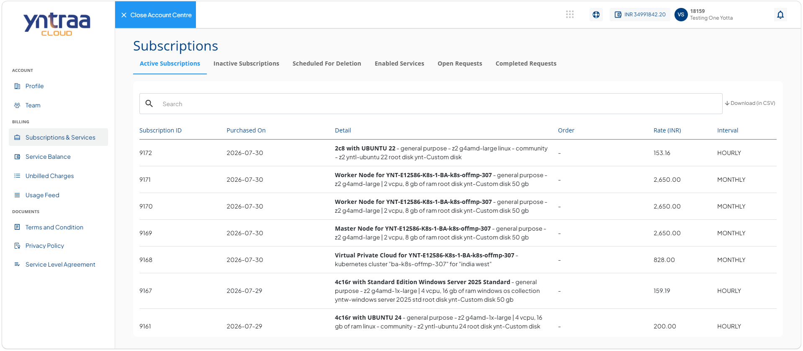
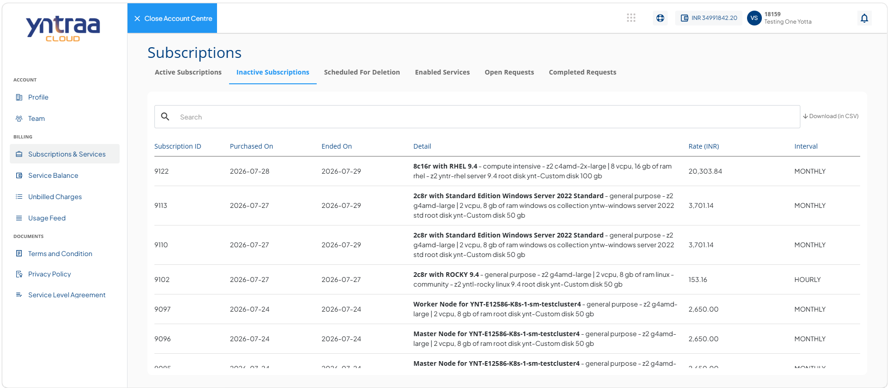
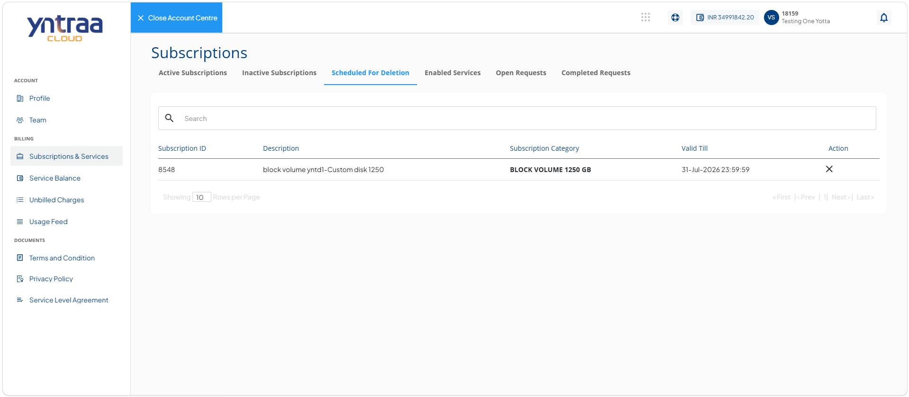
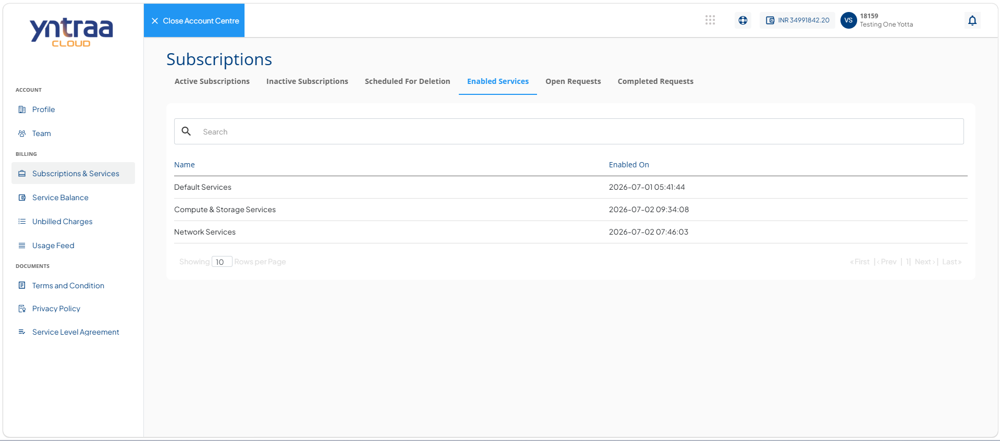
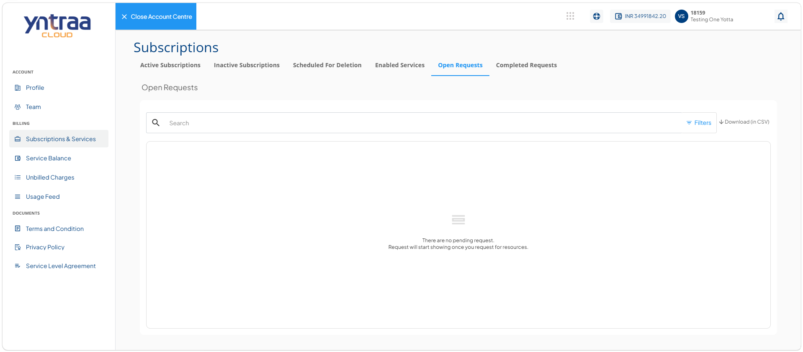
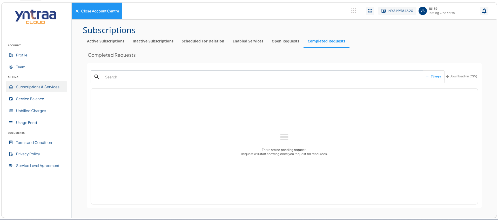

# Subscriptions and Services

A subscription is a record created whenever a new resource is purchased or a service is activated. In other words, a subscription is a financial ‘agreement’ that links the item that has been purchased, its value, and its renewal frequency.

To view your subscriptions and service details, follow these steps:

1. Navigate to [Yntraa Cloud portal](https://portal.yntraacloud.ai/).The following screen appears where you provide the required details: 
    
    - **Email**
    - **Password**.
2. Click the **Sign In** button. The following screen appears: 
   
3. Click the user profile id icon (highlighted in red). The following screen appears:
   
4. Click **Account**. The following screen appears: 
   
5. Navigate to **Billing > Subscriptions and Services**. The following screen appears:
   
   

   The following are the subscription details on the screen:  
- [Active Subscriptions](#active-subscriptions)
- [Inactive Subscriptions](#inactive-subscriptions)
- [Schedule for Deletion](#schedule-for-deletion)
- [Enable Services](#enable-services)
- [Open Requests](#open-requests)
- [Completed Requests](#completed-requests)

   
## Active Subscriptions

Active Subscriptions column shows a tabulated list of all subscriptions that are currently active in your account.

To view the active subscription details, navigate to **Billing > Subscriptions and Services**. The following screen appears: 

    :::note
    The data transfer and secondary storage subscriptions are always enabled by default.
    :::

## Inactive Subscriptions

Inactive Subscriptions column shows a tabulated list of all subscriptions that were active in the past. This includes all removed subscriptions.

To view the inactive subscription details, navigate to **Billing > Inactive Subscriptions**. The following screen appears: 

   
## Schedule for Deletion

The scheduled for deletion column lists subscriptions that are marked for deletion but remain within their validity period.

To view the details of services scheduled for deletion, navigate to **Billing > Scheduled for Deletion**. The following screen appears: 

## Enable Services

Enable Services column shows a tabulated list of all services that are currently enabled in your account. 

To view the details of enabled services, navigate to **Billing > Enabled Services**. The following screen appears: 

## Open Requests

Open Requests column shows a tabulated list of all service requests that are currently in progress or awaiting completion. 

To view the details of open requests, navigate to **Billing > Open Requests**. The following screen appears:

   
## Completed Requests

Completed Requests column shows a tabulated list of all service requests that have been successfully processed, approved, or withdrawn, along with their final status and details.

To view the details of closed requests, navigate to **Billing > Completed Requests**. The following screen appears:

   

