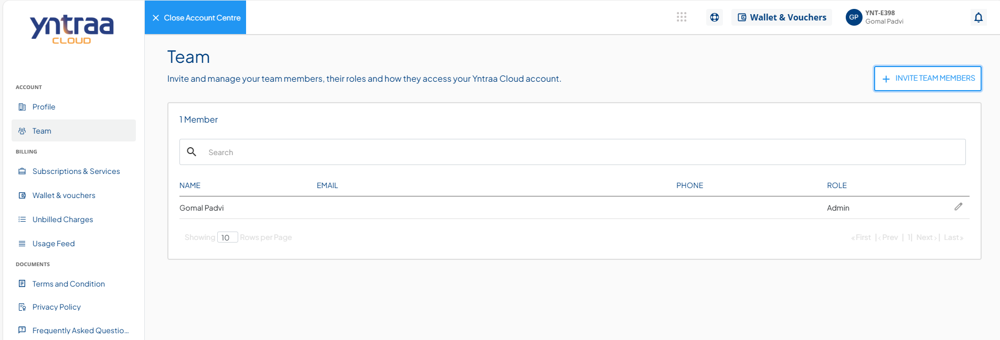
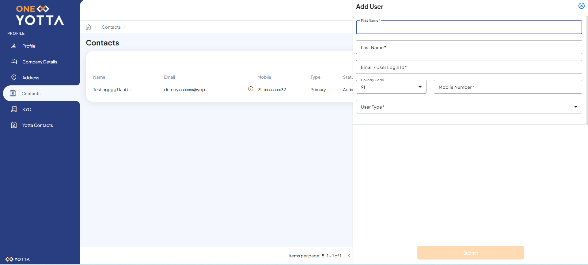

# Team Member Management

Team members can be onboarded using the **Team** section from the Account Centre, allows you to add commercial, technology or other admin users who can log in to your account and perform operations.

To add a team member, click the **+ INVITE TEAM MEMBERS** button in the top-right corner, which opens the **OneYotta** interface and allows you to enter the required information.

**Add User -** Name, Email, Mobile Number, etc., for the team member.
  :::note
  The team member/user can reset the password from the Yntraa Cloud.
  :::
**User Type -** The role of the team member. These can be:
    - **Admin -** Gets access to all functionalities.
    - **Commercial -** Gets permissions to perform billing actions and read-only for other actions.
    - **Technology -** Gets permissions to perform technical actions and read-only for other actions.
      
Click the **Submit** button. The team member is added and appears under the Team section.

Once the account is created, the team member receives an email notification.

The team member sets the password by clicking the **START NOW** button. The following window appears:

 Click the **Save** button to create the account successfully. The following window appears:
 
 
 
Click the **Click to Login** button to sign in to **OneYotta**.

