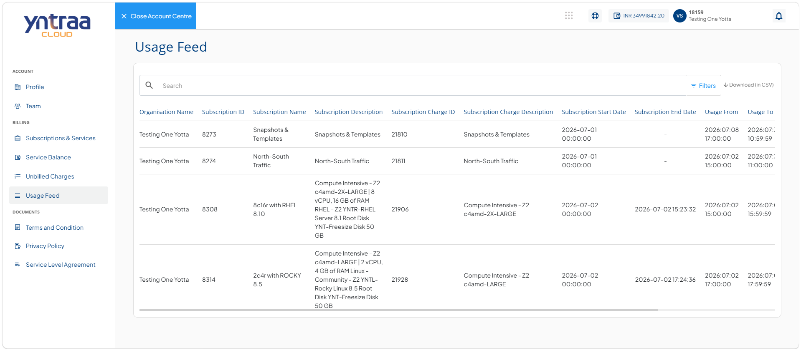

# Viewing Usage Feed Details

The usage feed or service usage provides a consolidated view of usage records for your subscribed services. It enables you to monitor subscription usage by displaying key details such as subscription information, usage period, and related charge information. You can also search, filter, and download the usage records to help review and track service consumption during the selected period.

To view your service usage details, follow these steps: 

1. Navigate to [Yntraa Cloud portal](https://portal.yntraacloud.ai/).The following screen appears where you provide the required details: 
    
    - **Email**
    - **Password**.
2. Click the **Sign In** button. The following screen appears: 
   
3. Click the user profile id icon (highlighted in red). The following screen appears:
   
4. Click **Account**. The profile tab opens automatically. The following screen appears: 
   
5. Navigate to **Billing > Usage Feed**. The following screen appears with the details:
   
   
- **Organisation Name:** The organisation name column displays the name of the organisation that owns the subscription associated with the usage record. This helps identify which organisation generated the recorded usage.

- **Subscription ID:** The subscription ID column displays the unique identifier assigned to a subscription. This ID helps distinguish one subscription from another and is useful for tracking, reporting, and support purposes.

- **Subscription Name:** The subscription name column displays the name of the subscribed service, product, or resource. It helps users quickly identify the specific subscription associated with the usage record.

- **Subscription Description:** The subscription description column provides additional information about the subscription. It describes the subscribed service or resource, helping users understand its purpose without opening the subscription details.

- **Subscription Charge ID:** The subscription charge ID column displays the unique identifier assigned to a specific subscription charge. This identifier is used to track individual billing components associated with the subscription.

- **Subscription Charge Description:** The subscription charge description column provides a description of the charge applied to the subscription. It identifies the billable resource or service for which the usage has been recorded.

   

 

