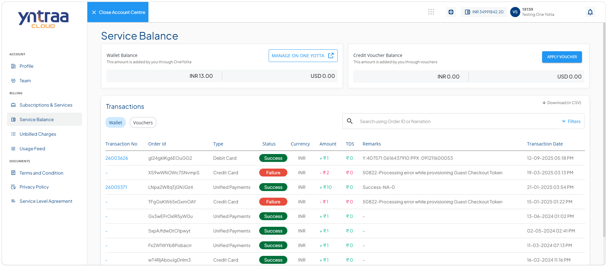

# Viewing Service Balance Details

The service balance provides a consolidated view of your available wallet balance, credit voucher balance, and transaction history. It enables you to monitor the funds available for service consumption, manage your wallet, apply credit vouchers, and review wallet and voucher transactions. You can also search, filter, and download transaction records, helping you efficiently track and manage your service balance and payment activities.

To view your service balance details, follow these steps: 

1. Navigate to [Yntraa Cloud portal](https://portal.yntraacloud.ai/). The following screen appears where you provide the required details: 
    
    - **Email**
    - **Password**.
2. Click the **Sign In** button. The following screen appears: 
   
3. Click the user profile ID icon (highlighted in red). The following screen appears:
   
4. Click **Account**. The profile tab opens automatically. The following screen appears: 
   
5. Navigate to **Billing > Service Balance**. The following screen appears with the details: 
   
   
- **View Wallet Balance:** View the available wallet balance added through the One Yotta wallet system. The balance is displayed in INR and USD.
- **Manage Wallet Balance:** Click **Manage on One Yotta** to access the wallet management options and perform wallet-related activities through the One Yotta portal.
 - **View Credit Voucher Balance:** View the available credit voucher balance added through applied vouchers. The balance is displayed in INR and USD.
- **Apply Credit Voucher:** Click **Apply Voucher** to add a credit voucher to the account. Enter the voucher details and submit the request to update the voucher balance.
- **View Wallet Transactions:** Select the **Wallet** tab to view wallet-related transactions, including payment and balance activities.
- **View Voucher Transactions:** Select the **Vouchers** tab to view all credit voucher-related transaction records.

