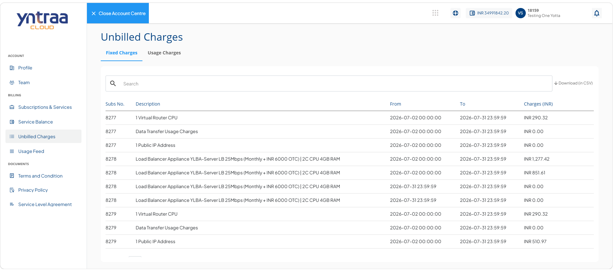
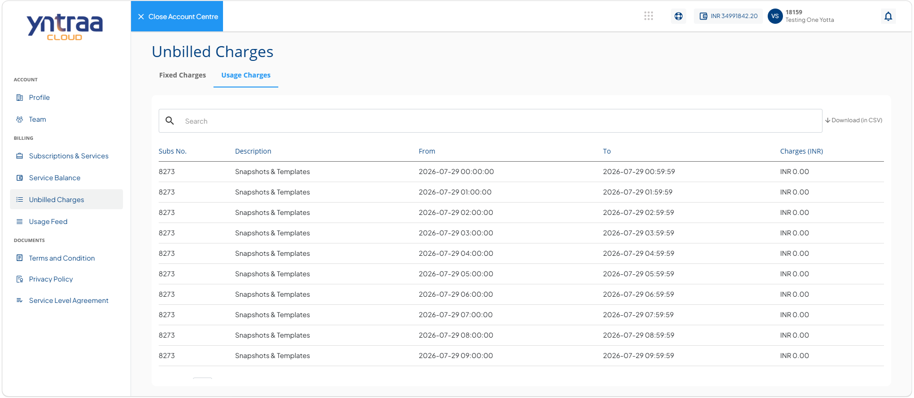

# Viewing Subscription Charges

The unbilled charges provides a consolidated view of charges that have been incurred for your active subscriptions but have not yet been included in an invoice. It enables you to monitor the estimated charges accumulated during the current billing cycle, helping you track your spending before the invoice is generated. The page includes charges for both fixed subscriptions and usage-based services, ensuring better visibility into ongoing costs.

To view your unbilled charge details, follow these steps: 

1. Navigate to [Yntraa Cloud portal](https://portal.yntraacloud.ai/).The following screen appears where you provide the required details: 
    
    - **Email**
    - **Password**.
2. Click the **Sign In** button. The following screen appears: 
   
3. Click the user profile id icon (highlighted in red). The following screen appears:
   
4. Click **Account**. The profile tab opens automatically. The following screen appears: 
   
5. Navigate to **Billing > Unbilled Charges**. The following screen appears with the unbilled charge details: 
   
   

  
- [Fix Charges](#fix-charges)
- [Usage Charges](#usage-charges)

   
## Fix Charges

Fixed subscriptions (recurring or non-recurring) incur charges that are calculated on a daily prorated basis by default.

To view fix charge details, navigate to **Billing > Unbilled Charges**. The following screen appears: 

## Usage Charges

Usage charges shows the actual charges incurred up to the previous hour, providing an up-to-date view of your consumption-based charges.

To view fix charge details, navigate to **Billing > Usage Charges**. The following screen appears: 

 

