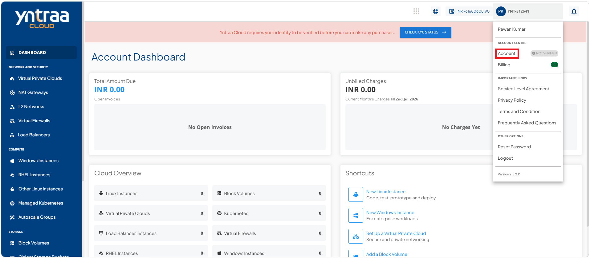
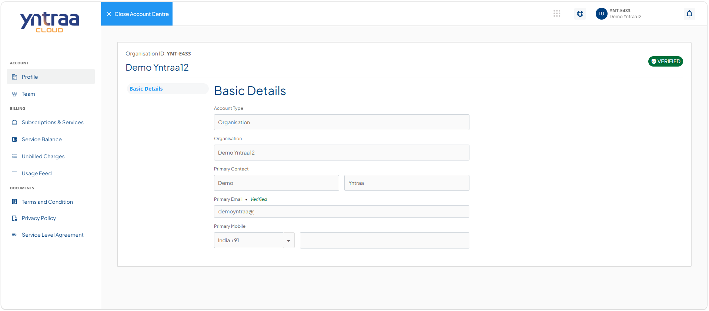
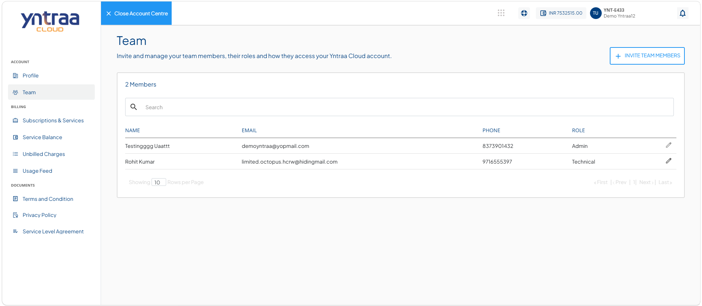
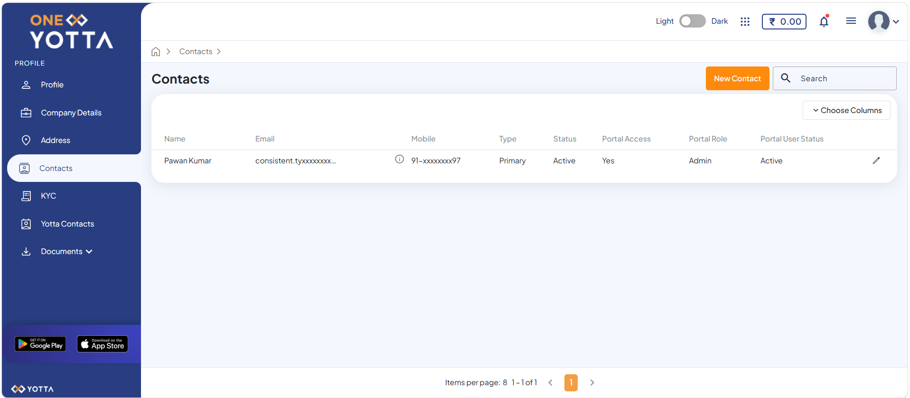
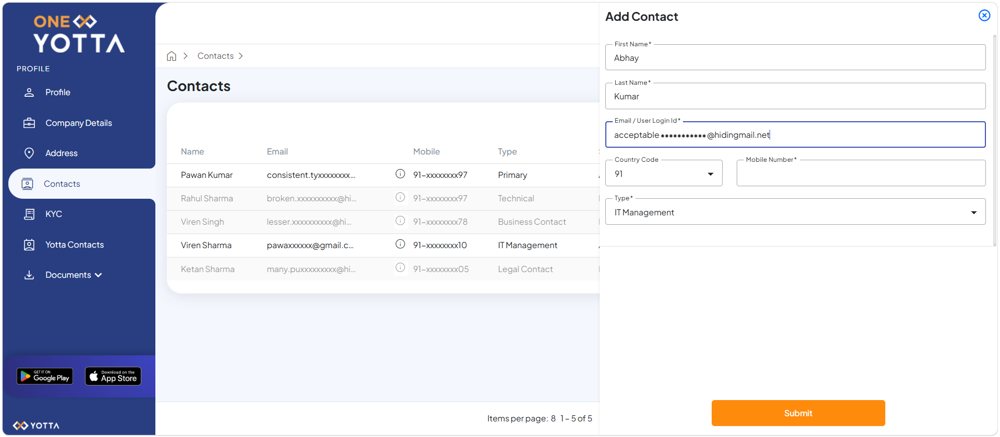
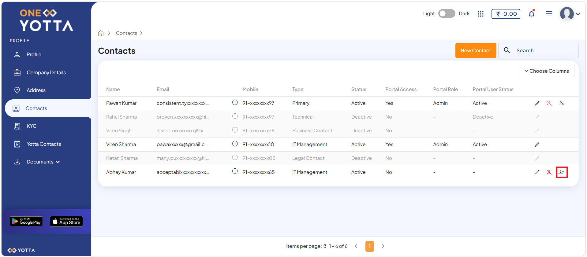
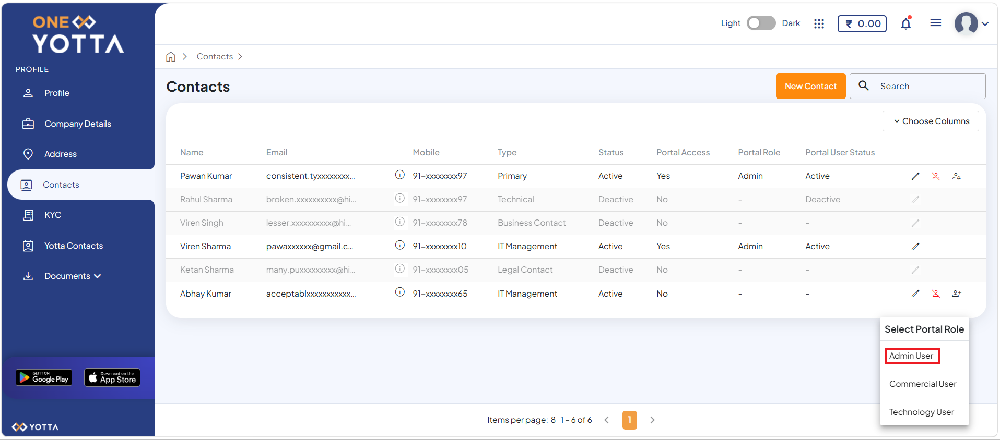
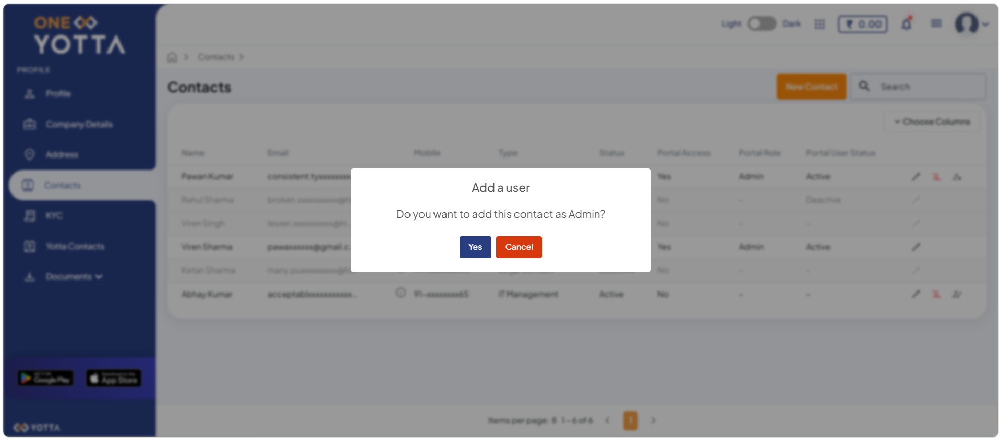
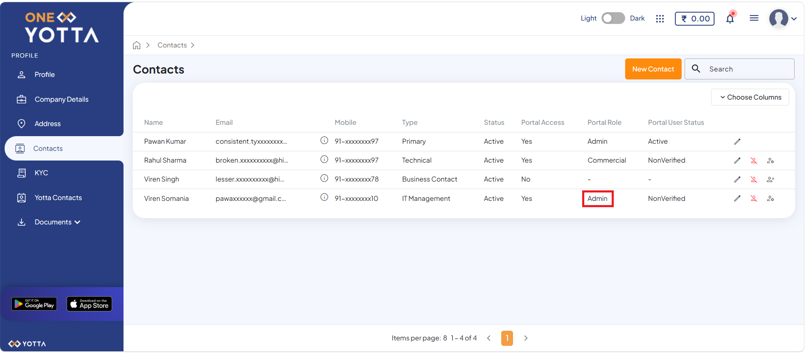

# Adding Team Members

[One Yotta](https://account.yotta.com) is Yotta’s unified customer portal that provides a single, secure platform to manage your account, services, assets, billing, and infrastructure monitoring. It centralizes essential management tasks, giving you complete visibility into your environment and enabling you to efficiently manage single or multiple deployments through an intuitive dashboard. 

To support secure collaboration while providing access to these capabilities, [One Yotta](https://account.yotta.com) implements Role-Based Access Control (RBAC). RBAC assigns permissions based on predefined roles, such as Admin, Commercial, and Technology, ensuring that each team member can access only the features and resources required for their responsibilities. This role-based approach strengthens security, simplifies access management, and improves operational efficiency across the organization.

To add a team member or child user, follow these steps:
1. Navigate to [Yntraa Cloud portal](https://portal.yntraacloud.ai/). The following screen appears:
   
2. Click the **Sign In** button. The following screen appears:
   
3. Click the **User Account ID** (for example, YNT-E433) and then click **Account** from the menu on the top-right corner. The following screen appears:
 
4. Navigate to **Account > Team**. The following screen appears:

5. Click the **+ Invite Team Members** button. The portal redirects you to the [One Yotta](https://account.yotta.com) platform and automatically opens the Contacts tab as shown in the screen.

6. Click the **New Contact** button. The following screen appears:

	:::note
	The Type field lets you assign multiple roles to a contact based on their responsibilities within the organisation.
	:::

7. Click the **Submit** button. The following screen appears:
 
   
	:::note
	Once a team member is added, a registration confirmation email is sent to their registered email address, allowing them to set their password and sign in to the One Yotta platform.
	:::

8. Click the **Add as Portal User** icon (highlighted in red). The following screen appears:
   
9. Select the appropriate portal role from the following options:    
    - **Admin** - Full access to all functionalities. 
    - **Commercial** - Permission to perform billing actions and read-only for other actions.
    - **Technology** - Permission to perform technical actions and read-only for other actions. 

	The following screen appears:
10. Click the **Yes** button. The system assigns the selected role to the team member. The following screen appears:
   
   

   
   
   
