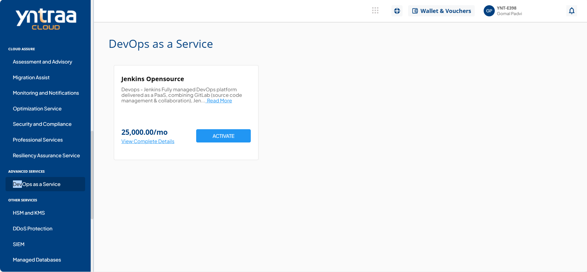
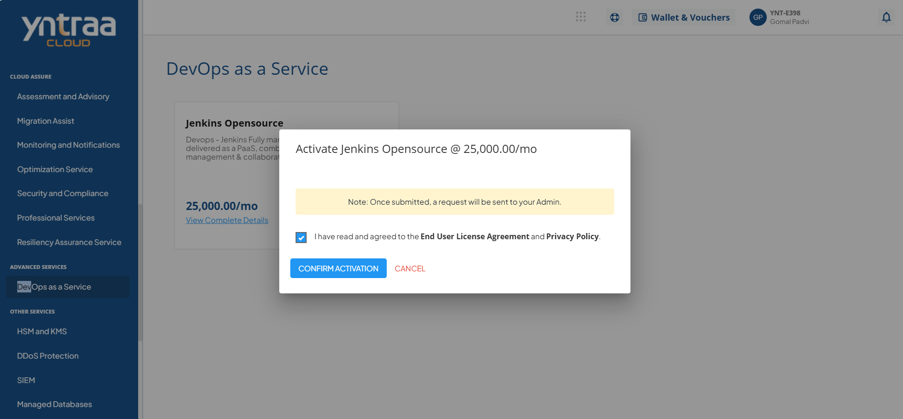

# DevOps as a Service

To activate the desired DevOps service, perform the following steps:
1. Navigate to **ADVANCED SERVICES** > **DevOps as a Service**. 
2. Click the **ACTIVATE** button. 
3. Select the I have read and agreed to the **End User License Agreement** and **Privacy Policy** option, and click **CONFIRM ACTIVATION** button.

Once submitted, a support ticket will be automatically generated for the operations team for further processing.
