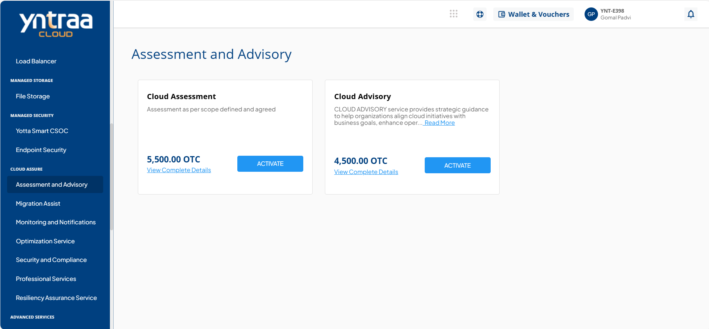
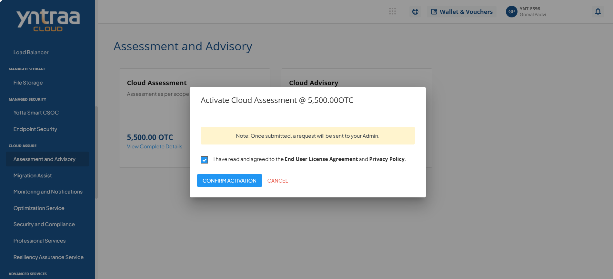

# Assessment and Advisory

Cloud Assessment and Advisory Service helps organizations assess their current IT landscape and define a clear, strategic roadmap for cloud adoption. It provides expert guidance and tailored recommendations to ensure a secure, cost-effective, and well-aligned cloud transformation.

To activate the desired assessment and advisory service, perform the following steps:
1. Navigate to **CLOUD ASSURE** > **Assessment and Advisory**.
2. Click the **ACTIVATE** button.
3. Select the I have read and agreed to the **End User License Agreement** and **Privacy Policy** option, and click **CONFIRM ACTIVATION** button.
   
Once submitted, a support ticket will be automatically generated for the operations team for further processing.
   
For more information about the assessment and advisory service, [click here](downloads/CloudAssessmentandAdvisoryService.pdf).