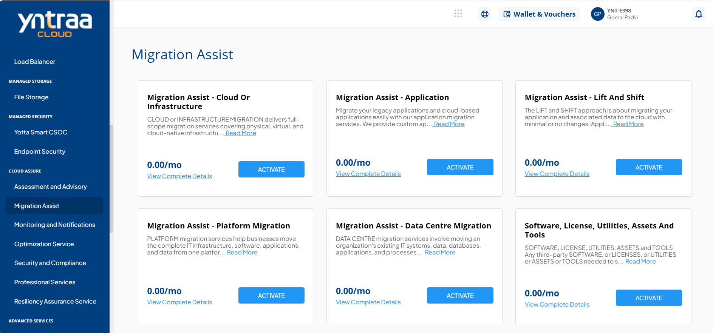
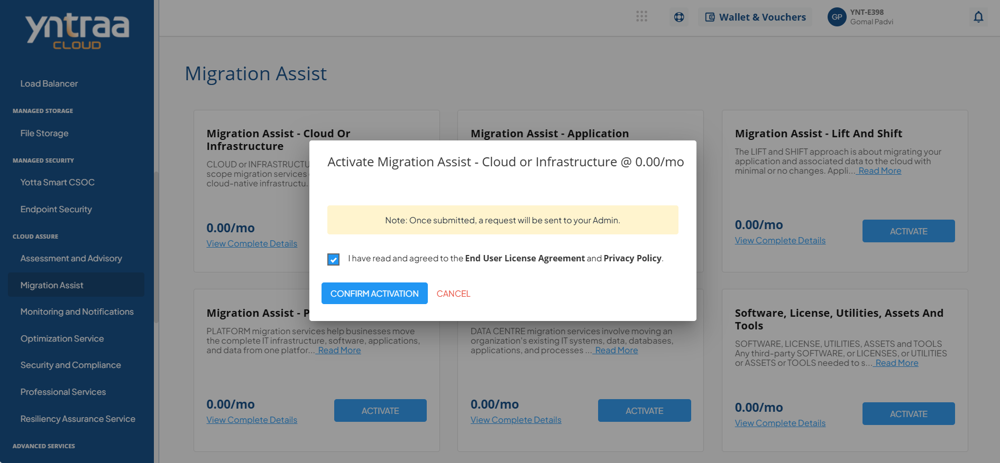

# Migration Assist

Cloud Migration Service enables the secure and seamless transition of applications, data, and infrastructure to cloud or hybrid environments. Through a structured approach and tailored migration strategies, it minimizes risk and disruption while accelerating the benefits of cloud adoption. 

To activate the desired migration assist service, perform the following steps:
1. Navigate to **MANAGED COMPUTE** > **Migration Assist**.
2. Click the **ACTIVATE** button.
3. Select the I have read and agreed to the **End User License Agreement** and **Privacy Policy** option, and click **CONFIRM ACTIVATION** button.
   
For more information about the cloud migration assist service, [Click here](downloads/CloudMigrationAssistService.pdf).