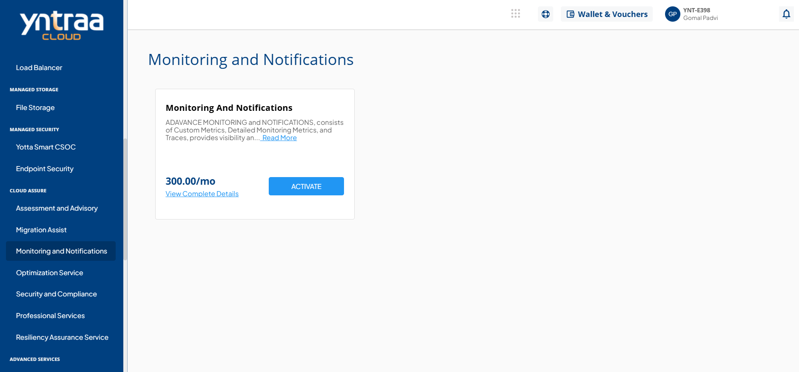
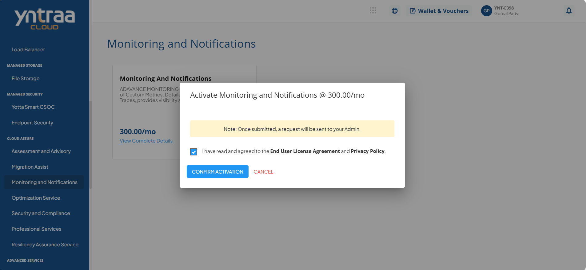

# Monitoring and Notifications

Cloud Monitoring and Notification Service ensures continuous visibility into the health and performance of cloud resources through real-time monitoring, centralized logging, and automated alerts. It enables timely issue detection and response, helping maintain uptime, 
optimize performance, and reduce manual oversight. 

To activate the desired monitoring and notifications service, perform the following steps:
1. Navigate to **MANAGED COMPUTE** > **Monitoring and Notifications**. 
2. Click the **ACTIVATE** button. 
3. Select the I have read and agreed to the **End User License Agreement** and **Privacy Policy** option, and click **CONFIRM ACTIVATION** button.

Once submitted, a support ticket will be automatically generated for the operations team for further processing.

For more information about the cloud monitoring and notification service, [click here](downloads/CloudMonitoringandNotificationService.pdf).

