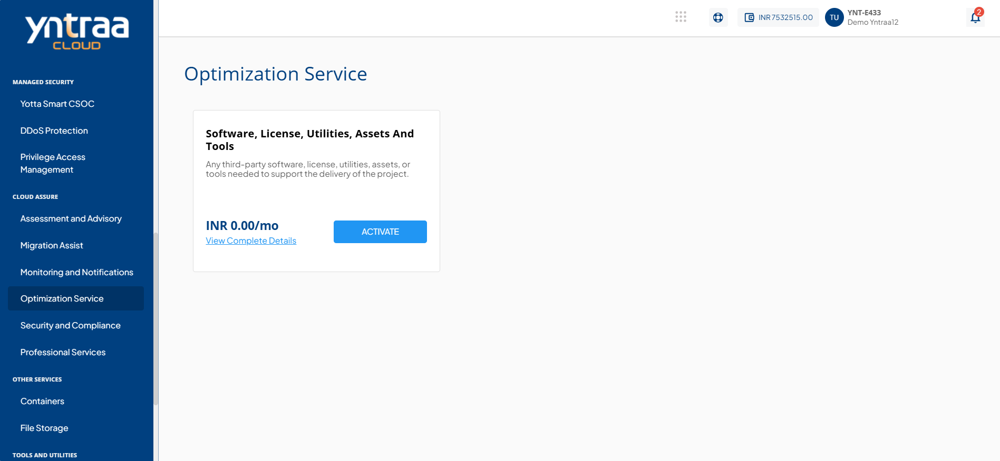
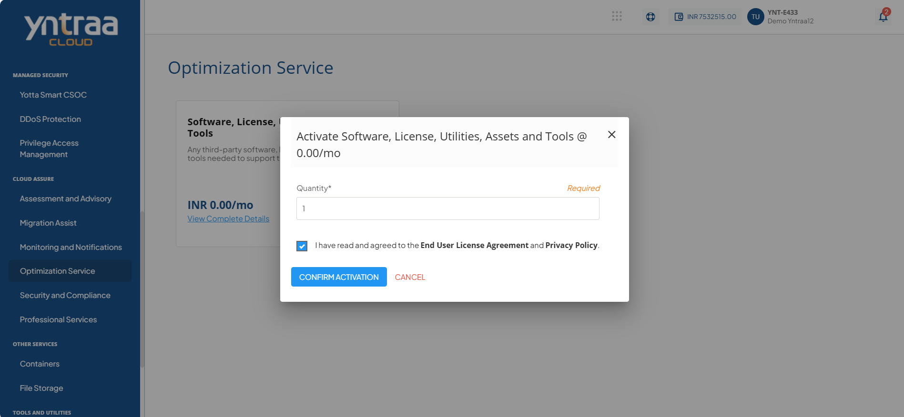

# Optimization Service

Cloud Optimisation Service enhances cost and performance efficiency across hybrid and multi-cloud environments through a structured, FinOps-aligned approach. It identifies optimisation opportunities, strengthens cost governance, and enables organisations to reduce waste while maximizing the value of their cloud investments. 

To activate the desired optimisation service, perform the following steps:
1. Navigate to **CLOUD ASSURE** > **Optimization Service**. 
2. Click the **ACTIVATE** button. 
3. Select the I have read and agreed to the **End User License Agreement** and **Privacy Policy** option, and click **CONFIRM ACTIVATION** button.

Once submitted, a support ticket will be automatically generated for the operations team for further processing.

For more information about the Cloud optimisation service, [click here](downloads/CloudOptimisationService.pdf).

