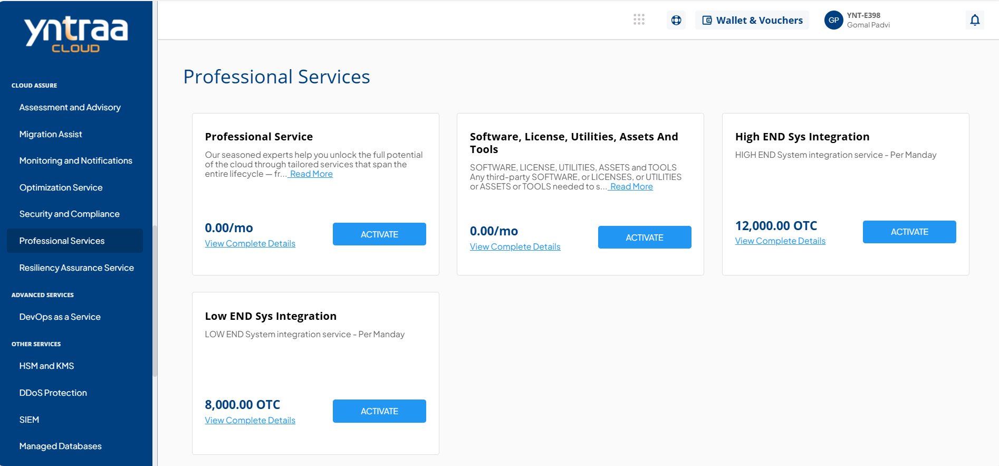
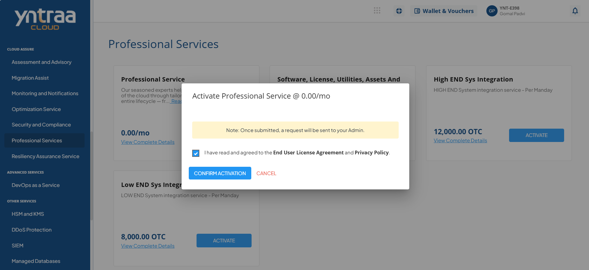

# Professional Services

Cloud Professional Services provide structured, expert-led support to help organizations plan, implement, and optimize their cloud environments. These services cover the complete cloud lifecycle, including strategy, migration, modernization, and ongoing improvement. 

Through proven methodologies and best practices, they ensure secure, scalable, and efficient cloud adoption aligned with business objectives. 

To activate the desired professional service, perform the following steps:
1. Navigate to **CLOUD ASSURE** > **Professional Services**.
2. Click the **ACTIVATE** button.
3. Select the I have read and agreed to the **End User License Agreement** and **Privacy Policy** option, and click **CONFIRM ACTIVATION** button.

For more information about the professional service, [click here](CloudProfessionalService.pdf).