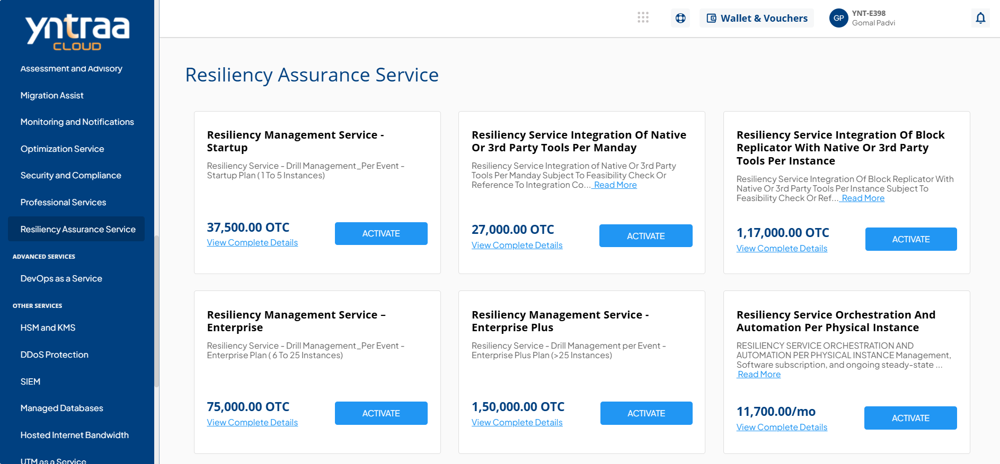
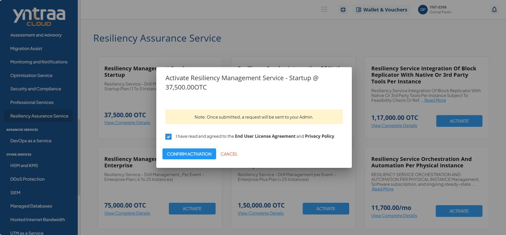

# Resiliency Assurance Service

Resiliency Assurance Service is a disaster recovery, focused solution designed to help organizations quickly restore critical infrastructure, applications, and data after disruptions. 

By combining proven resiliency methodologies with cloud-based automation and orchestration, it ensures seamless failover, reliable recovery, and minimal business impact across hybrid IT environments.

To activate the desired resiliency assurance service, perform the following steps:
1. Navigate to **CLOUD ASSURE** > **Resiliency Assurance Service**. 
2. Click the **ACTIVATE** button. 
3. Select the I have read and agreed to the **End User License Agreement** and **Privacy Policy** option, and click **CONFIRM ACTIVATION** button.
   
   For more information about the resiliency assurance service, [click here](downloads/ResiliencyAssuranceService.pdf).
