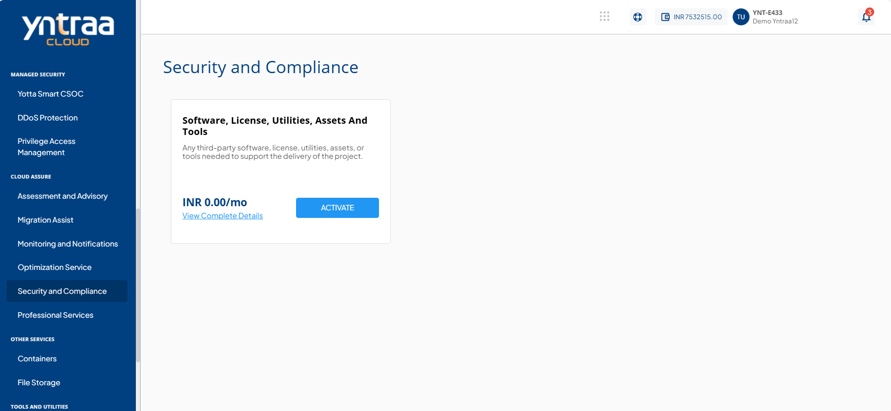
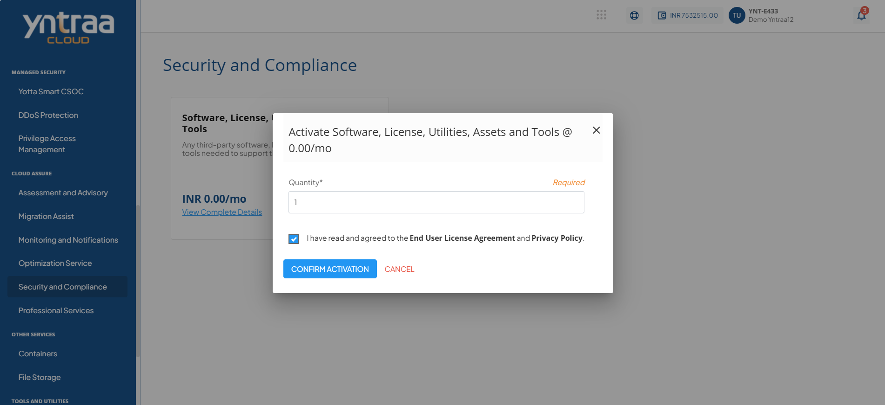

# Security and Compliance

To activate the desired security and compliance service, perform the following steps:
1. Navigate to **CLOUD ASSURE** > **Security and Compliance**. 
2. Click the **ACTIVATE** button. 
3. Select the I have read and agreed to the **End User License Agreement** and **Privacy Policy** option, and click **CONFIRM ACTIVATION** button.
   
Once submitted, a support ticket will be automatically generated for the operations team for further processing.
