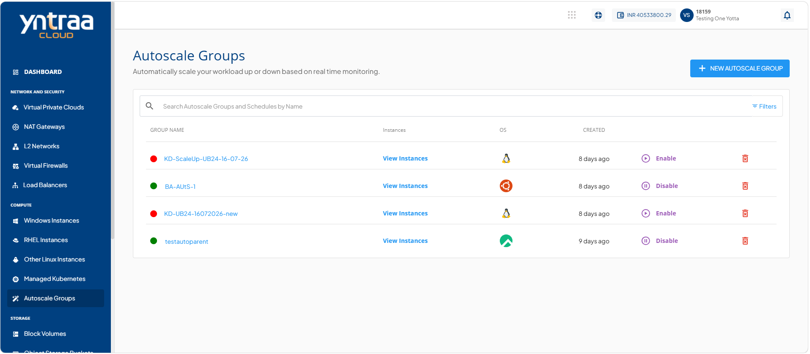
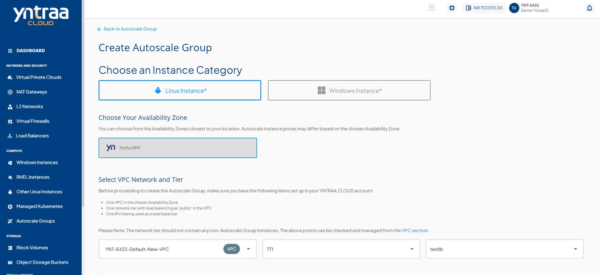
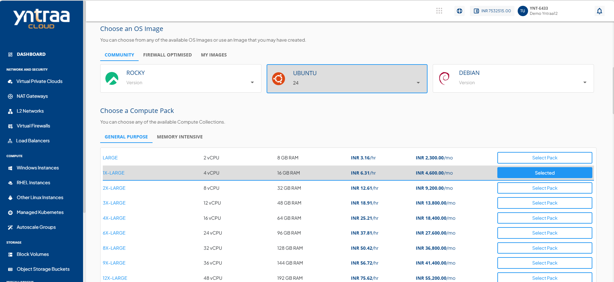
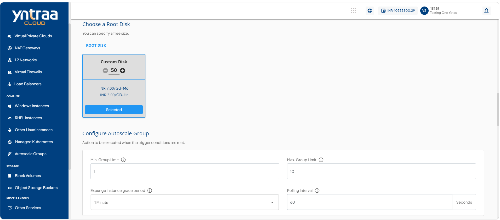
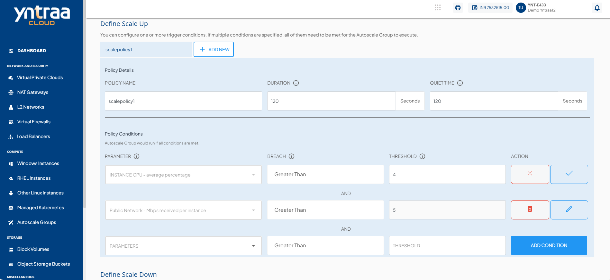
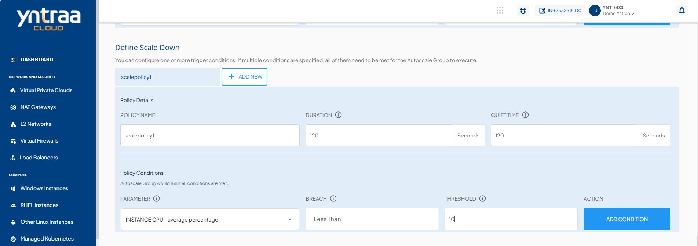
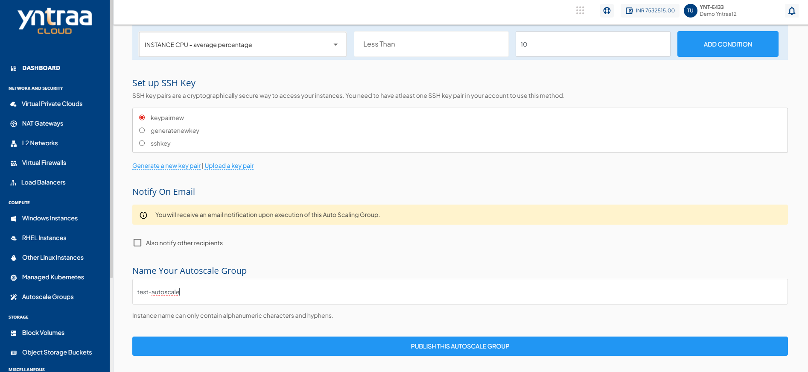

# Creating Autoscale Groups

Creating an Autoscale group enables automatic scaling of compute instances based on workload demand and defined scaling policies. This helps maintain application performance, improve availability, and optimize resource utilization by automatically adding or removing instances as needed.

To create Autoscale group, follow these steps:

1. Navigate to **Compute > Autoscale Groups**. The following screen appears: 
   
2. Click the **New Autoscale Group** button. The following screen appears: 
    
   
   
   
   
   
3. Select an instance category.
4. Select the availability zone that represents the geographic region where you want to deploy your auto-scaled instance.
5. Select VPC network, choose the appropriate tier in **Select a Network Tier**, and then select a load balancer from the options in the **Select Load Balancer** dropdown.
6. Select the OS image.
7. Select a compute pack from the available compute collections.
8. Select a **Root Disk** for your Auto Scale group from the available options or choose **Custom Disk** to define the size. Adjust the disk size as required, and click **Select Pack** to confirm.
9. Configure the Autoscale group by specifying all the required options:
	- **Min. Group Limit:** This is the minimum number of members in the Autoscale group. The number of instances in the group will be equal to or more than this number.
    - **Max. Group Limit:** This is the maximum number of members in the Autoscale group. The number of instances in the group will be equal to or more than this number.
    - **Expunge Instance grace period:** This defines how long before a scale-down is executed should the app/user connections to an Instance be removed.
    - **Polling Interval:** This defines at what interval should the Autoscale group check your policy conditions and execute the relevant scale or scale-down configurations.
    :::note  
    The **Polling Interval** must be between 60 and 3600 seconds.  
    :::
10. Define the scale up policy (Multiple policies can be configured; if multiple conditions are specified, all of them must be met for the Autoscale group to execute) by specifying all the required options:
	- **Policy Name**: Specify the name for your policy.
	- **Duration (in mins):** This is the duration in which the conditions have to be true before action is taken.
	- **Quiet Time (in mins):** The cool-down period in which the policy should not be evaluated after the action has been taken.
	- **Parameter:** Performance parameters represent the current state of the monitored instances. This feature currently supports the following parameters:
		- **Instance CPU Percentage** - Average percentage
		- **Instance Memory** - Average percentage
		- **Public Network** - mbps received per instance
		- **Public Network** - mbps transmit per instance
		- **Load Balancer** - Average connections per instance
	- **Breach:** Relational operator to be used with threshold. This will be greater than by default.
	- **Threshold:** This is the value for which the counter will be evaluated with the operator selected.
11. Click the **Add Condition** button.
12.  Define the **Scale Down Policy**. The parameters are similar to the scale up policy. Only the breach parameter will be less than by default.
        :::note  
        The reading **Duration** (The time period during which the system monitors metrics before triggering a scaling action.) must be at least 60 seconds. The **Quiet Time** must be between 120 and 3600 seconds.  
        :::
13. Configure the SSH key settings. If your account does not have an SSH key pair, select **Generate a New Key Pair** to create one. You can also select **Upload a Key Pair** to upload an existing key pair.
14. Enable email notifications to receive updates when the Auto Scale group executes. Select **Also notify other recipients** to add additional email recipients from the dropdown list. The default email address is selected automatically.
15. Enter name of your Autoscale group in **Name Your Autoscale Group**.
16. Click the **Publish This Autoscale Group** button. The Autoscale group is created.

