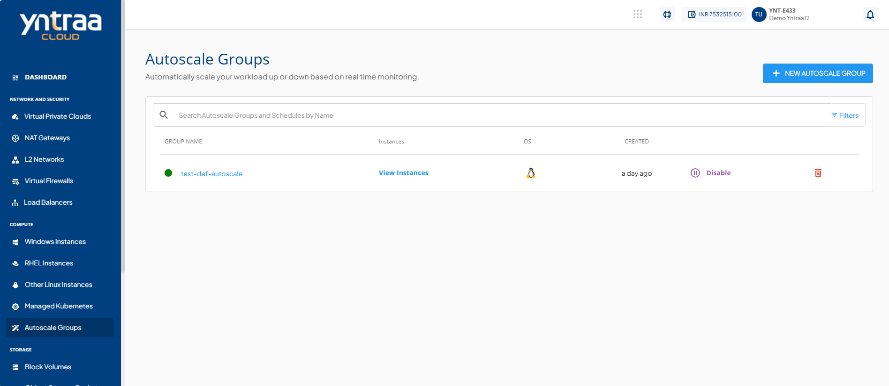
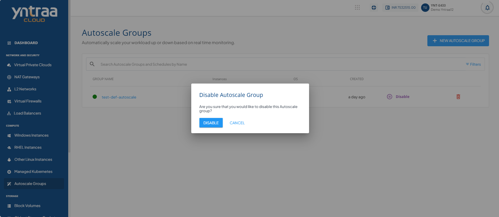
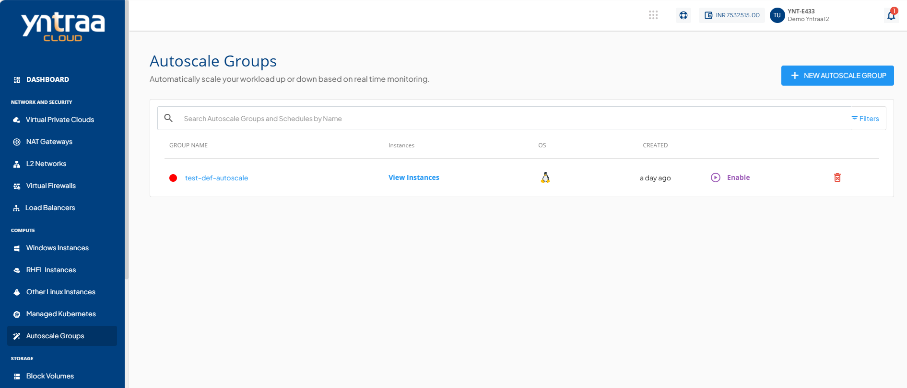
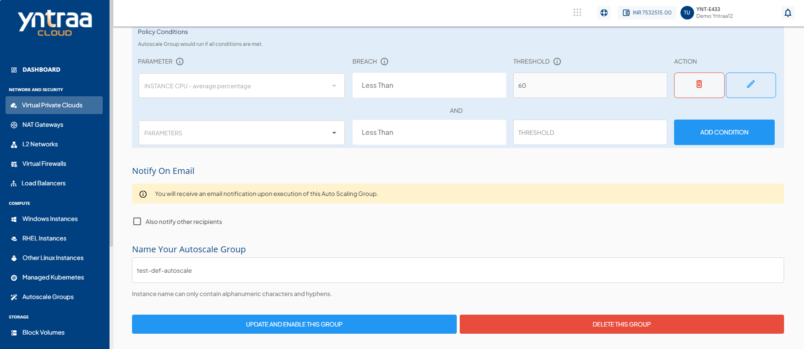
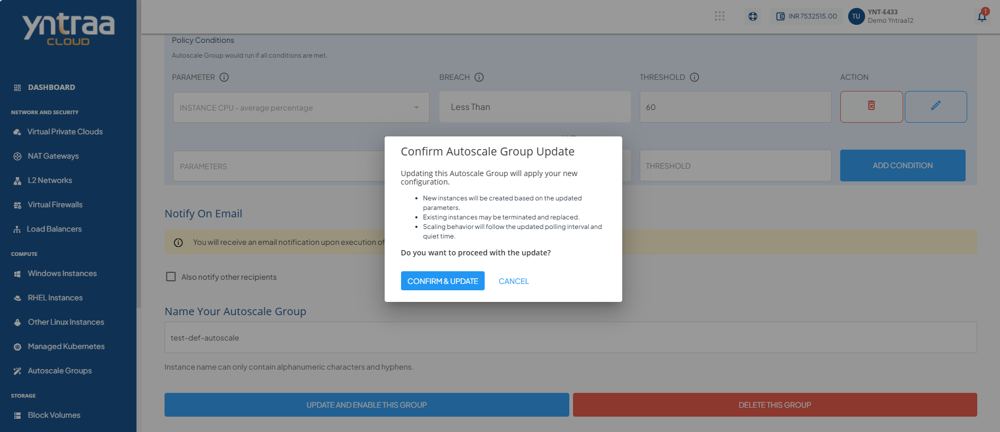

# Modifying Configurations

To modify the Autoscale Group configuration settings, follow these steps: 
1. Navigate to **Compute > Autoscale Groups**. The following screen appears: 
2. Click the **Disable** icon. The following screen appears:  
3. Click the **Disable** button. The following screen appears:  
4. Click the autoscale group under the **Group Name** column (for example, **test-def-autoscale**) to open its settings and modify the following configurations:   
   
    - OS image (must belong to the same zone)
    - Compute offering (CPU/RAM)
    - Disk size (≥ template minimum) 

   
      
    :::note
    When using custom images to create or update an Autoscale Group, the root disk settings are applied based on the image configuration. Images with a fixed disk size use the default value, images that support overrides display the minimum size by default, and images without a defined disk size require you to select a disk offering or enter a custom size.
    :::

5. Click **Update and Enable this Group**. The following screen appears:  
6. Click the **Confirm and Update** button to save and apply the updated configuration. 

