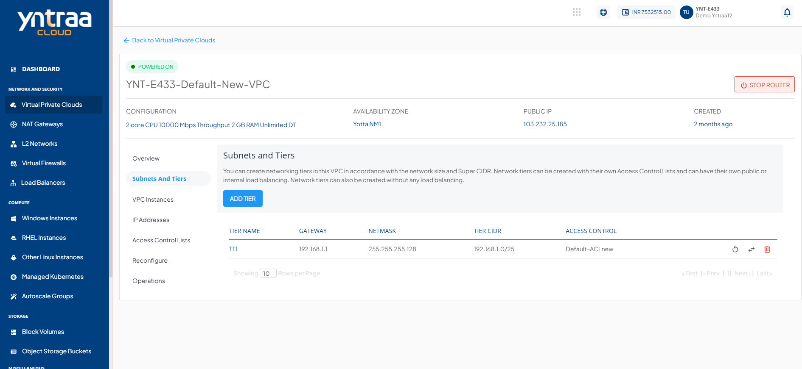
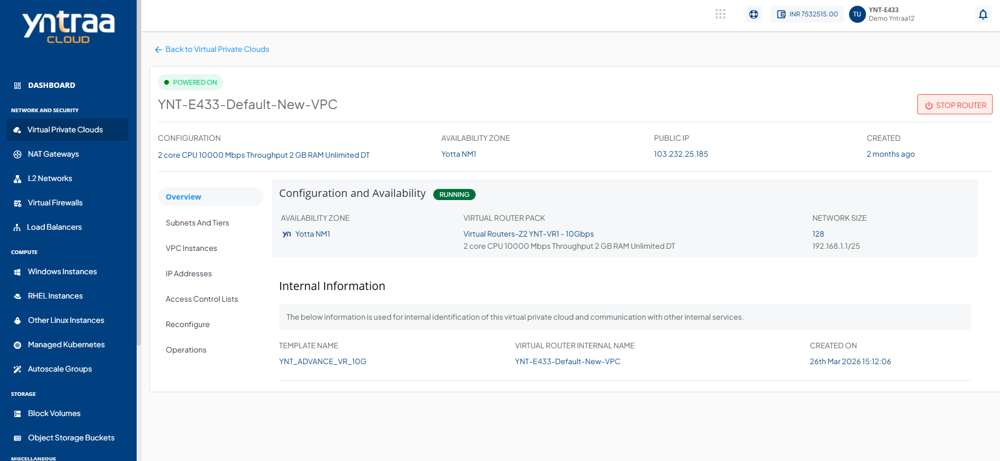
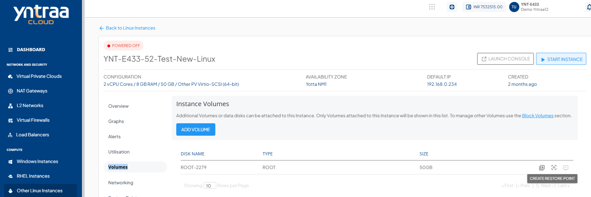
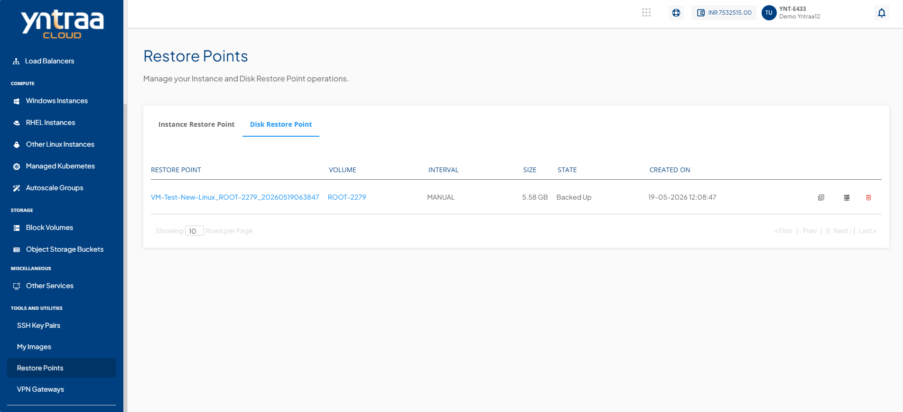
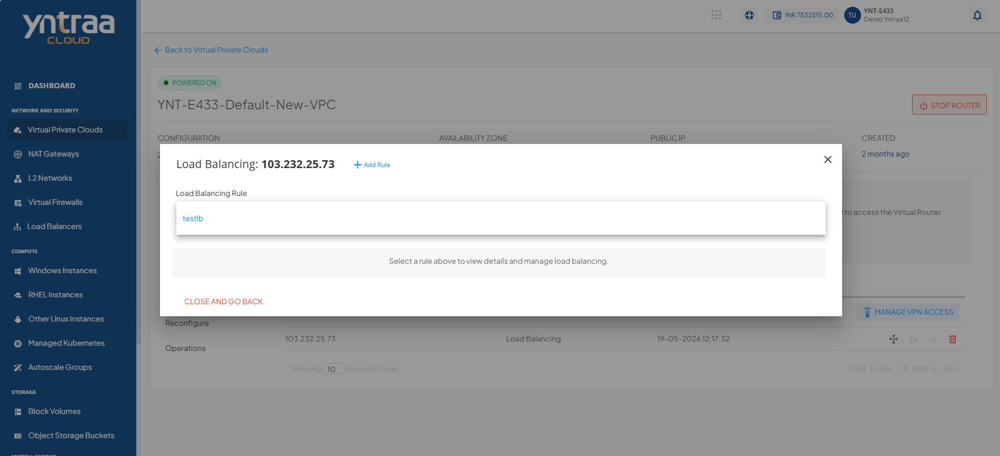

# Using Static Password In Autoscale Group Instance

Using static password in an auto scale group instance feature enables you to use a common login password for instances created within an auto scale group. It helps ensure a consistent authentication experience across all automatically provisioned instances, simplifying instance access and management.

1. Create a VPC and add a network tier inside the VPC.
     
2. Create a instance using the standard templates.
   
3. Launch the console and login with the initial password (Generated at the time of instance creation).
4. Run the following commands: 
	1. Create your password.  `sudo passwd <yourusername>` (ubuntu/root)
	2. Disable the password expiry.  `sudo chage -I -1 -m 0 -M 99999 -E -1 <yourusername>` (ubuntu/root)
	3. Ensure password Authentication is enabled (If using SSH).  `sudo vi /etc/ssh/sshd_config`
	4. Make sure the following lines are set correctly.  `PasswordAuthentication yes` 
	5. Restart the SSH Service.  `sudo systemctl restart ssh`   
	6. Stop the cloud-init service.   `sudo systemctl stop cloud-init` 
	7. Uninstall cloud-init.  `sudo apt purge cloud-init -y` `sudo rm -rf /etc/cloud`  
	9. Remove cloud-init data and configuration.   `sudo rm -rf /var/lib/cloud`   `sudo sed -i '/cloud-init/d' /etc/default/grub`
	11. Remove any cloud-init entry from the grub.  `sudo update-grub`
	12. Reboot the system.  `sudo reboot`
5. Stop the instance from the Yntraa cloud platform and create a disk restore point of that instance.

6. Create Image using the restore point. (After creation, it will be visible in the **My Image** section).

7. Navigate to the **VPC section**, purchase an IPv4 address, and create a load balancing rule using the acquired IPv4 address.

8. Create the Auto Scale Group using the custom template (**My Image**).

9. You can now log in to the initial instance using the static password (the same one used for the standard instance). Additionally, you can successfully log in to the secondary instance using the same static password.

