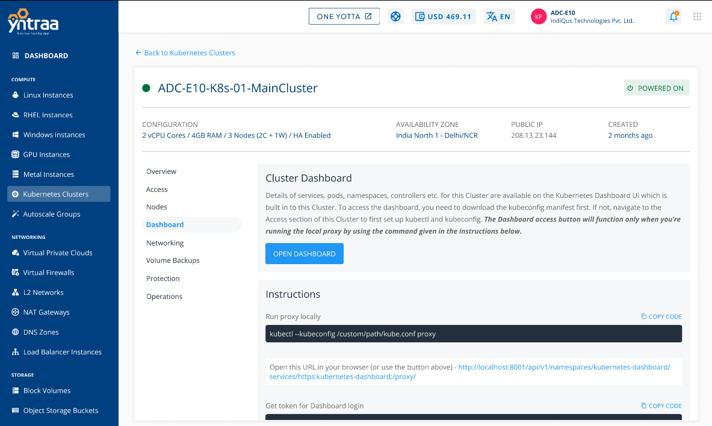

# About Kubernetes Dashboard

The Kubernetes Dashboard is a web-based user interface that provides a visual representation of a cluster's resources and enables easier management and monitoring. Here's an overview of the dashboard:

- **Features:** The dashboard displays various cluster resources, such as pods, services, nodes, deployments, and more. It offers an interactive view of the cluster's current state.
- **Access Control:** Access to the dashboard is subject to RBAC (Role-Based Access Control) policies. Users need appropriate permissions to view and modify resources.
- **Monitoring:** While the dashboard provides essential monitoring, more comprehensive monitoring solutions like Prometheus and Grafana can be integrated for in-depth insights.

  
Details of services, pods, namespaces, controllers etc. for a Kubernetes cluster are available on the Kubernetes Dashboard UI. To access the dashboard, the `kubeconfig` manifest needs to be downloaded and used.

If not, navigate to the **Access** section of a cluster to first [set up kubectl and kubeconfig](AccessingaClusterusingtheCommandLine).

Once done, a local proxy needs to be run using the command given below:

```
kubectl --kubeconfig /custom/path/kube.conf proxy
```

If everything is set up correctly, open this [URL](http://localhost:8001/api/v1/namespaces/kubernetes-dashboard/services/https:kubernetes-dashboard:/proxy/)  in your browser or use the **OPEN DASHBOARD** button in the **Dashboard** section of cluster details.

:::note
Each Kubernetes cluster has its own dashboard.
:::
## Getting Token for Dashboard Login

To login to the cluster dashboard, a token needs to be obtained which can be done using the following command on the CLI:

```
kubectl --kubeconfig /custom/path/kube.conf describe secret $(kubectl --kubeconfig /custom/path/kube.conf get secrets -n kubernetes-dashboard | grep kubernetes-dashboard-token | awk '{print $1}') -n kubernetes-dashboard
```

To learn how to access the dashboard from version 1.24 onwards, refer to [Accessing the Dashboard](Accessingthekubernetesdashboard.md)

:::note
More information about accessing the Kubernetes Dashboard UI can be found [here](https://kubernetes.io/docs/tasks/access-application-cluster/web-ui-dashboard/#accessing-the-dashboard-ui).
:::


