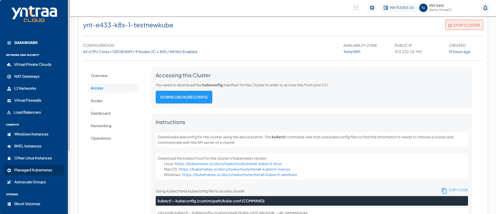

# Accessing a Cluster using the Command Line

You can access and control the Kubernetes clusters from the command line using the `kubeconfig` manifest for the cluster. Each cluster has a unique manifest which is required to identify and target the cluster using the `kubectl` utility.

You can download the manifest for a cluster using the **Download Kubeconfig** button in the **Access** section of the cluster details.


## Using kubectl

On the CLI, use the following command to access the cluster:

```
kubectl --kubeconfig /custom/path/kube.conf {COMMAND}
```

```
List pods kubectl --kubeconfig /custom/path/kube.conf get pods --all-namespaces  
  
List nodes kubectl --kubeconfig /custom/path/kube.conf get nodes --all-namespaces  
  
List services kubectl --kubeconfig /custom/path/kube.conf get services --all-namespaces  
```
 
Download kubeconfig for the cluster using the above button. The kubectl command-line tool uses kubeconfig files to find the information it needs to choose a cluster and communicate with the API server of a cluster.

## Downloading kubectl

You can download the kubectl utility for the correct Kubernetes version for any of these operating systems:

- [Linux](https://storage.googleapis.com/kubernetes-release/release/v1.23.3/bin/linux/amd64/kubectl )
- [MacOS](https://storage.googleapis.com/kubernetes-release/release/v1.23.3/bin/darwin/amd64/kubectl)
- [Windows](https://storage.googleapis.com/kubernetes-release/release/v1.23.3/bin/windows/amd64/kubectl.exe)


