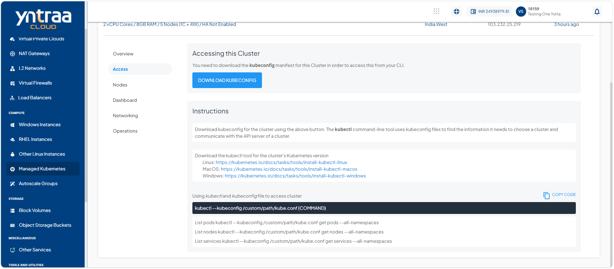
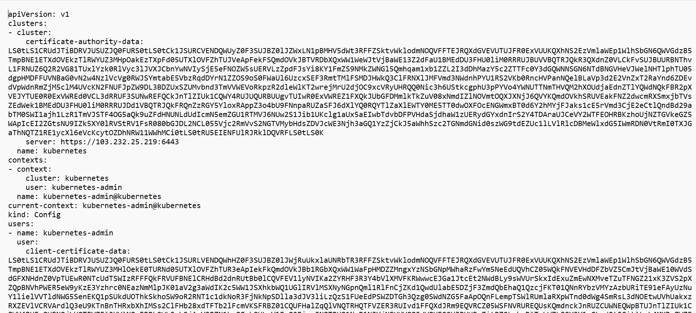
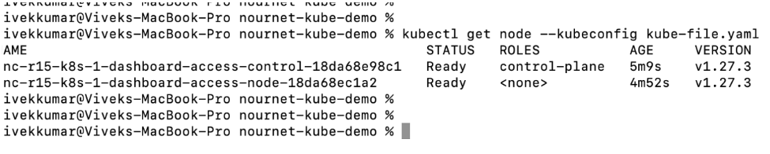
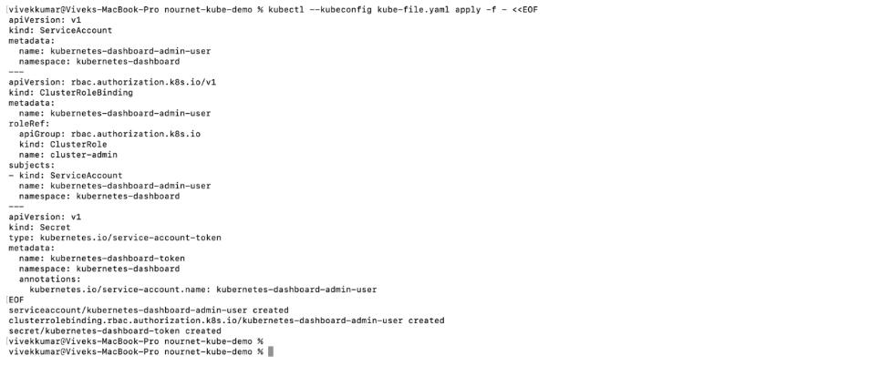
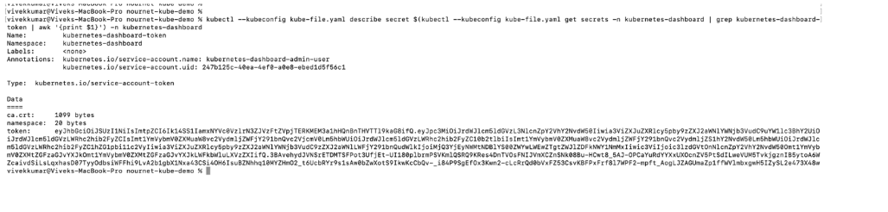
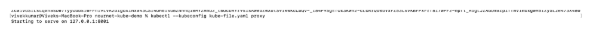
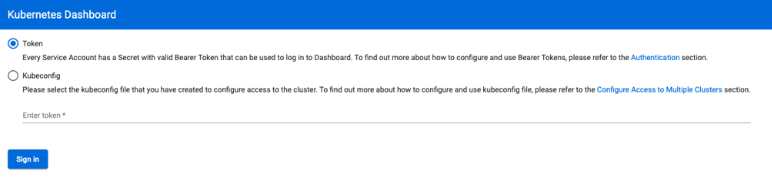
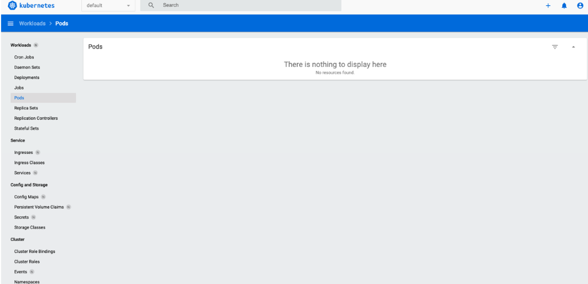

# Accessing the Kubernetes Dashboard

Accessing the kubernetes dashboard enables you to securely connect to and view the kubernetes dashboard for your cluster. The process involves obtaining the required access configuration, verifying cluster connectivity, configuring authentication, and signing in to the dashboard through a web browser. This provides a centralized interface for viewing and managing kubernetes resources.

To access the dashboard in kubernetes version 1.24 and onwards, follow these steps:

1. Navigate to **Compute > Managed Kubernetes**. The following screen appears: 
    
2. Click on your created kubernete cluster name from the list. The Overview tab opens automatically. The following screen appears: 
   
3. Click **Access**. The following screen appears: 
   
4. Click the **Download Kubeconfig** button to download the `kubeconfig` file. The following screen appears: 
   
	
	 :::note
	Ensure that `kubectl` is installed on your system or any system from which you are trying to access the kubernetes API.
	 :::

5. Verify access by running the following commands: <br/>
	`# kubectl get node --kubeconfig kube-file.yaml`<br/>
	`# kubectl get pods --kubeconfig kube-file.yaml`<br/>
	`# kubectl get services --kubeconfig kube-file.yaml`<br/><br/>
	You should be able to see the following output:
	

6.  Create a service account and a secret token to access the dashboard.
	- **For Windows**: 
	1. Create a YAML file using the following details: 
		```
		apiVersion: v1
		kind: ServiceAccount
		metadata:
		name: kubernetes-dashboard-admin-user
		namespace: kubernetes-dashboard
		---
		apiVersion: rbac.authorization.k8s.io/v1
		kind: ClusterRoleBinding
		metadata:
		name: kubernetes-dashboard-admin-user
		roleRef:
		apiGroup: rbac.authorization.k8s.io
		kind: ClusterRole
		name: cluster-admin
		subjects:
		- kind: ServiceAccount
		  name: kubernetes-dashboard-admin-user
		  namespace: kubernetes-dashboard
		---
		apiVersion: v1
		kind: Secret
		type: kubernetes.io/service-account-token
		metadata:
		  name: kubernetes-dashboard-token
		  namespace: kubernetes-dashboard
		  annotations:
		    kubernetes.io/service-account.name: kubernetes-dashboard-admin-user
		```

	1. Run the following command:<br/>
		 `#kubectl --kubeconfig /custom/path/kube.conf apply -f file.yaml`

- **For Linux**: 
	1. Copy the following code on the CLI:<br/>
		```
		kubectl --kubeconfig /custom/path/kube.conf apply -f - 
			apiVersion: v1
			kind: ServiceAccount
			metadata:
			  name: kubernetes-dashboard-admin-user
			  namespace: kubernetes-dashboard
			---
			apiVersion: rbac.authorization.k8s.io/v1
			kind: ClusterRoleBinding
			metadata:
			  name: kubernetes-dashboard-admin-user
			roleRef:
			  apiGroup: rbac.authorization.k8s.io
			  kind: ClusterRole
			  name: cluster-admin
			subjects:
			- kind: ServiceAccount
			  name: kubernetes-dashboard-admin-user
			  namespace: kubernetes-dashboard
			---
			apiVersion: v1
			kind: Secret
			type: kubernetes.io/service-account-token
			metadata:
			  name: kubernetes-dashboard-token
			  namespace: kubernetes-dashboard
			  annotations:
			    kubernetes.io/service-account.name: kubernetes-dashboard-admin-user
		```

	You should be able to see the following output:
	

5. Fetch the secret token for dashboard login using the following command:
	```
	# kubectl --kubeconfig /custom/path/kube.conf describe secret $(kubectl -- kubeconfig /custom/path/kube.conf get secrets -n kubernetes-dashboard | grep kubernetes-dashboard-token | awk '{print $1}') -n kubernetes-dashboard
	```
	:::note
	Windows users must run the command in PowerShell.
	:::

You should be able to see the token in the output.

6. Run the following command to start the proxy for the kubernetes cluster: 

		`# kubectl --kubeconfig /custom/path/kube.conf proxy`

You should be able to see the following output:

7. Open the following URL on your browser:
   
[http://localhost:8001/api/v1/namespaces/kubernetes-dashboard/services/https:kubernetes-dashboard:/proxy/](http://localhost:8001/api/v1/namespaces/kubernetes-dashboard/services/https:kubernetes-dashboard:/proxy/)

To view the dashboard interface, select **Token**, paste the token fetched from **Step 5**, and click **Sign in**.

