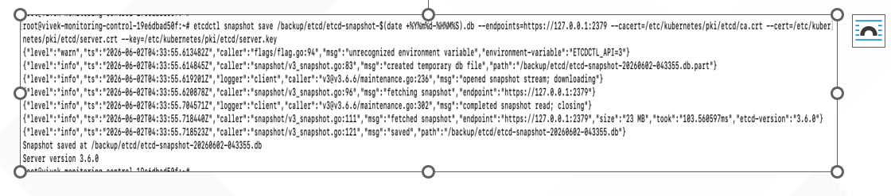

# Backuping and Restoring ETCD
This section describes the procedure for backing up and restoring the Kubernetes ETCD database. It covers creating ETCD snapshots, verifying snapshot integrity, and restoring ETCD in the event of cluster corruption, accidental data deletion, control plane failures, or disaster recovery scenarios.  
  
The ETCD database stores the following critical Kubernetes cluster information:
    - Cluster state
    - Nodes
    - Deployments
    - Secrets
    - ConfigMaps
    - RBAC configurations
    - Persistent Volume definitions

## Prerequisites
Ensure the following prerequisites are met before proceeding:

### Requiring Access
Ensure that the following access requirements are available before performing ETCD backup and restore operations:
    - Root or sudo access on the Kubernetes control plane nodes.
    - Access to the ETCD certificates.
    - kubectl installed and configured on the master node.
    
To verify that ETCD is running, run the following command:  

`kubectl get pods -n kube-system | grep etcd`

Example output:

`etcd-master01 1/1 Running`
  
## Identifying ETCD Configuration
To check the ETCD static pod manifest, run the following command:

`cat /etc/kubernetes/manifests/etcd.yaml`

Locate:  
    - ETCD endpoints
    - Certificate file paths

Common Paths:
    - Certificate file
    - Key file
    - Trusted CA file
    - ETCD data directory

## Taking ETCD Backup
To take ETCD backup, perform the following steps: 

1. To create a backup directory, run the following command:

   `mkdir -p /backup/etcd`

2. To export ETCDCTL API version, run the following command:

   `export ETCDCTL_API=3`

3. To take snapshot backup, run the following command:

```
etcdctl snapshot save /backup/etcd/etcd-snapshot-$(date +%Y%m%d-%H%M%S).db  
  --endpoints=https://127.0.0.1:2379  
  --cacert=/etc/kubernetes/pki/etcd/ca.crt  
  --cert=/etc/kubernetes/pki/etcd/server.crt  
  --key=/etc/kubernetes/pki/etcd/server.key
```

  Expected Output:
  
  `Snapshot saved at /backup/etcd/etcd-snapshot-20260602-120000.db`
  
   
## Backup Retention Recommendation
This section defines the recommended ETCD backup retention policy.

- Recommended:  
        - Daily ETCD backup  
  
- Retain:  
        - 7 daily backups
        - 4 weekly backups
        - 3 monthly backups  
  
- Store backups:  
        - Local disk
        - NFS share
        - S3 bucket / MinIO
        - DR site

## Automating ETCD Backup
To automate ETCD backup, perform the following steps:

1. Create the backup script:

    `/usr/local/bin/etcd-backup.sh`

 Add the following in the etcd-backup.sh file
  
```
#!/bin/bash
```

```
BACKUP_DIR="/backup/etcd"
DATE=$(date +%Y%m%d-%H%M%S)
```

`export ETCDCTL_API=3`

`mkdir -p ${BACKUP_DIR}`

```
 etcdctl snapshot save ${BACKUP_DIR}/etcd-${DATE}.db
   --endpoints=https://127.0.0.1:2379
   --cacert=/etc/kubernetes/pki/etcd/ca.crt
   --cert=/etc/kubernetes/pki/etcd/server.crt
   --key=/etc/kubernetes/pki/etcd/server.key
```

`find ${BACKUP_DIR} -type f -mtime +7 -delete`

3. To make script executable, run the following command:      

   `chmod +x /usr/local/bin/etcd-backup.sh`

4. To configure Cron Job, run the following command:      

   `crontab -e`
   
Add:

`0 1 * * * /usr/local/bin/etcd-backup.sh >> /var/log/etcd- backup.log 2>&1`  
  
This will take backup daily at 1 AM.
   
## ETCD Restoring Procedure
Restore should only be performed during the following events:
    - Disaster recovery
    - Complete cluster corruption
    - Control plane rebuild  
  
Always stop Kubernetes components before restoring.

## Restoring ETCD Snapshot
To restore ETCD snapshot, perform the following steps with commands:

1. Stop Kubelet.  

   `systemctl stop kubelet`

2. Backup Existing ETCD data.  

   `mv /var/lib/etcd /var/lib/etcd-old`

3. Restore Snapshot.  

   `export ETCDCTL_API=3`  

```
etcdctl snapshot restore /backup/etcd/etcd-snapshot-20260602-120000.db \  
  --data-dir=/var/lib/etcd
```

## Verifying ETCD Manifest
To verify ETCD manifest, run the following commands:

Edit:

`/etc/kubernetes/manifests/etcd.yaml`

Ensure:

`--data-dir=/var/lib/etcd`

Matches restored directory. 

## Starting Kubernetes Services
To start the kubernetes services, run the following command:  
  
`systemctl start kubelet`

Wait 2–5 minutes.

## Verifying Cluster Health  
To verify the cluster health, perform the followings steps:

1. Checking Nodes

   `kubectl get nodes`

2. Checking System Pods 

   `kubectl get pods -A`
  
3. Verifying ETCD Health

   `export ETCDCTL_API=3`

```
etcdctl endpoint health \
   --endpoints=https://127.0.0.1:2379 \
   --cacert=/etc/kubernetes/pki/etcd/ca.crt \
   --cert=/etc/kubernetes/pki/etcd/server.crt \
   --key=/etc/kubernetes/pki/etcd/server.key
```

Expected Output:  

`https://127.0.0.1:2379 is healthy`   

## ETCD Backup Best Practices
This section highlights best practices for maintaining secure and reliable backup operations:

- Keep Backup Outside Cluster

   Always ensure backups are not stored only within the cluster; maintain copies in external and secure storage locations.

  `/var/lib/etcd`

- Encrypt Backup

   This section explains the importance of encrypting ETCD backups and the recommended tools to securely protect sensitive data.
  
    - ETCD contains:  
        - Secrets
        - Tokens
        - Certificates

    - Use:  
        - GPG
        - Vault
        - Encrypted object storage

- Monitoring Backup Status

   Implement a monitoring and alerting system to ensure backup health, detect failures, identify anomalies in backup size, and track the freshness of snapshots.

    - Integrate:  
        - Cron monitoring
        - Zabbix
        - Prometheus alerts  


    - Alert if:  
        - Backup failed
        - Backup size abnormal
        - Snapshot older than 24 hours

- Testing Restore Regularly

   Implement regular validation of ETCD backups by performing scheduled restore tests, including monthly disaster recovery (DR) drills to ensure data integrity and recovery readiness.

- Multi-Master Consideration

   This section explains backup considerations in multi-master ETCD clusters and how to identify cluster members to ensure reliable backup management.

    - In HA clusters:  
        - You can take backups from any healthy ETCD member.
        - Prefer leader node.

    - Checking member:  
      To check member, run the following command:  
  
      `etcdctl member list`

## Verifying Installation

Check the status of monitoring pods to ensure they are running properly by executing the following command.

`kubectl get pods -n monitoring`

Expected output should show pods in running state.

```
NAME                                                    READY   STATUS    RESTARTS 
alertmanager-prometheus-kube-prometheus-alertmanager-0  2/2     Running   0 
prometheus-grafana-6b8d4f6f58-abcde                     3/3     Running   0 
prometheus-kube-prometheus-operator-xxxxx               1/1     Running   0 
prometheus-kube-state
```

## Accessing Grafana
To access Grafana, which is automatically deployed by the Helm chart along with a default admin password and required configurations, perform the following steps:

1. To forward Grafana Service Port, run the following command to access Grafana locally:

   `kubectl port-forward svc/prometheus-grafana 3000:80 -n monitoring`

2. Access Grafana UI by opening the following URL in web browser: 

   `[http://localhost:3000](http://localhost:3000)` 

3. Default Grafana Credentials.

- Username: admin 

- Retrieve the automatically generated admin password by running the following command:

```
kubectl get secret --namespace monitoring prometheus
-grafana -o jsonpath="{.data.admin-password}" | base64 
--decode; echo`
```

## Accessing Prometheus

To access Prometheus, perform the following steps:

1. Forward Prometheus Service Port by running the following command:

   `kubectl port-forward svc/prometheus-kube-prometheus-prometheus 9090:9090 -n monitoring`

2. Access Prometheus UI by opening the following URL in web browser: 

   `[http://localhost:9090](http://localhost:9090)`

## Validation Checks

After deployment, verify the following validation checks: 
    - All pods in the monitoring namespace are running. 
    - Grafana dashboard is accessible. 
    - Prometheus UI is accessible. 
    - Kubernetes cluster metrics are visible in Prometheus. 
    - Grafana dashboards are automatically populated.
      
## Troubleshooting

To troubleshoot common issues, perform the following steps: 

1. Check Helm Release Status by running the following command:

   `helm list -n monitoring` 

2. Check Pod Logs by running the following command:  

    Example:

    `kubectl logs -n monitoring <pod-name>`

3. Describe Failed Pods by running the following command:

    `kubectl describe pod <pod-name> -n monitoring` 

## Conclusion

Prometheus and Grafana have now been successfully deployed on the Kubernetes cluster using the Kube-Prometheus-stack Helm chart. The environment is ready for monitoring Kubernetes’ workloads, infrastructure metrics, and alerting integration.