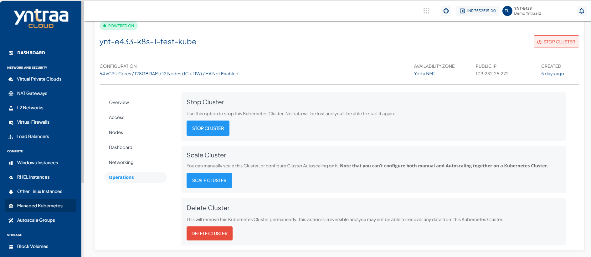
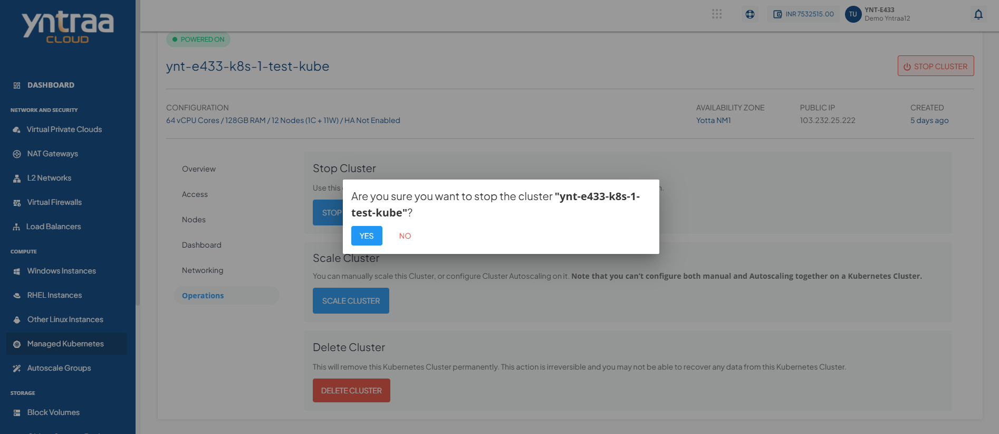
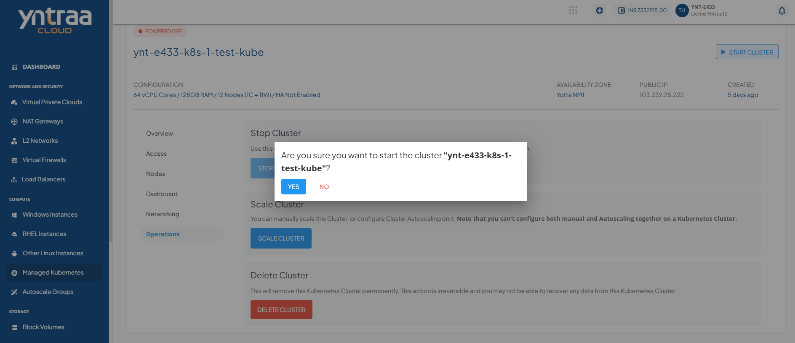
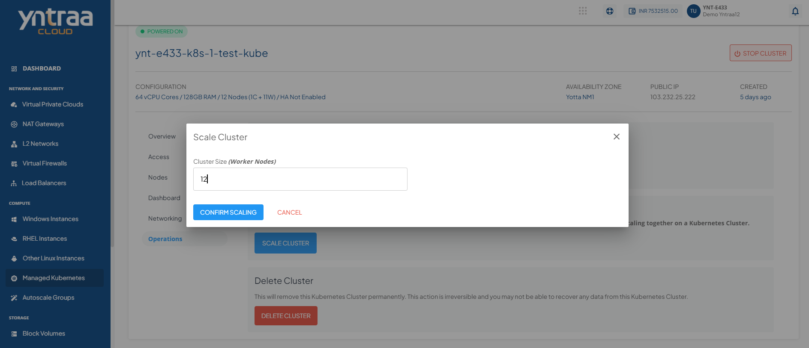
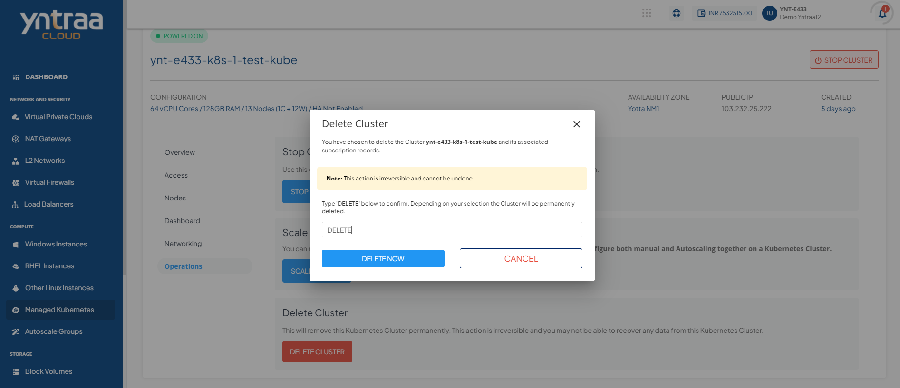

# Cluster Operations

Kubernetes clusters created on Yntraa Cloud allow for a set of management operations from the cloud console UI. While these options can be controlled using `kubectl`, these are provided on the UI for quick and easy access.

## Powering ON/OFF a Cluster

You can power ON/OFF a Kubernetes cluster using the **Stop/Start Cluster** button on top-right corner of the cluster details screen. This button shows in **green** when a cluster is powered ON, and red when powered OFF.
## Stopping and Restarting a Cluster

You can stop or restart a Kubernetes cluster from the **Operations** section of cluster details screen.

- **Stop Cluster** - To stop the Kubernetes cluster. No data will be lost, and the cluster can be started again.

- **Restart Cluster** - This action restarts the Virtual Router and the cluster nodes can/should be used if a Kubernetes Cluster has become unresponsive or unreachable.

- **Scaling Cluster** - This action is to manually scale this Cluster, or configure Cluster Autoscaling on it. 	

:::note
You can not configure both manual and Autoscaling together on a Kubernetes cluster.
:::
## Deleting a Cluster

To delete a cluster permanently, type **DELETE** to confirm, and click the **Delete Now** button.

:::note
This action is irreversible, and no data from a deleted Kubernetes cluster can be recovered.
:::

