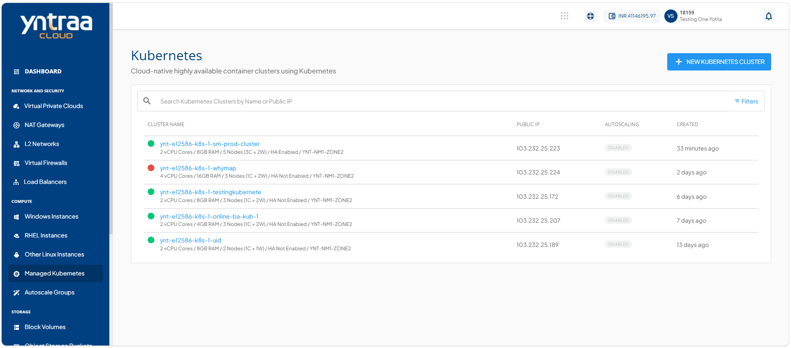
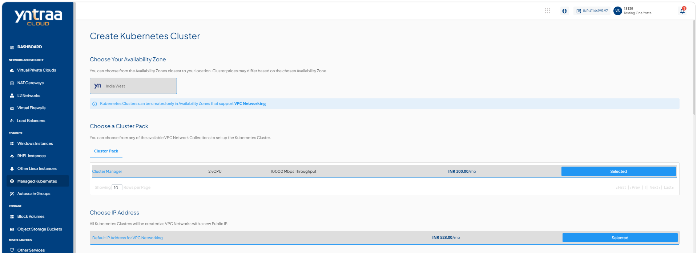
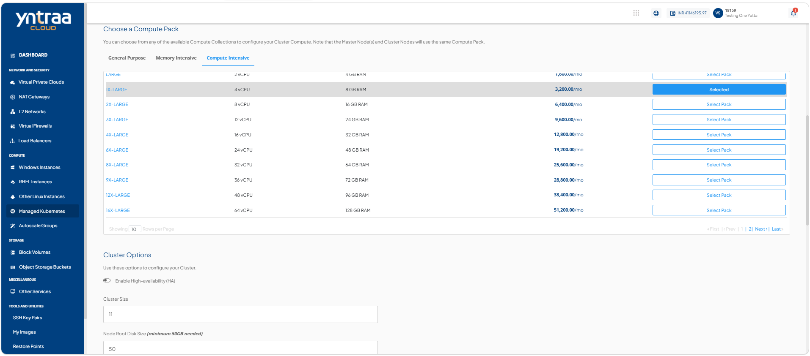
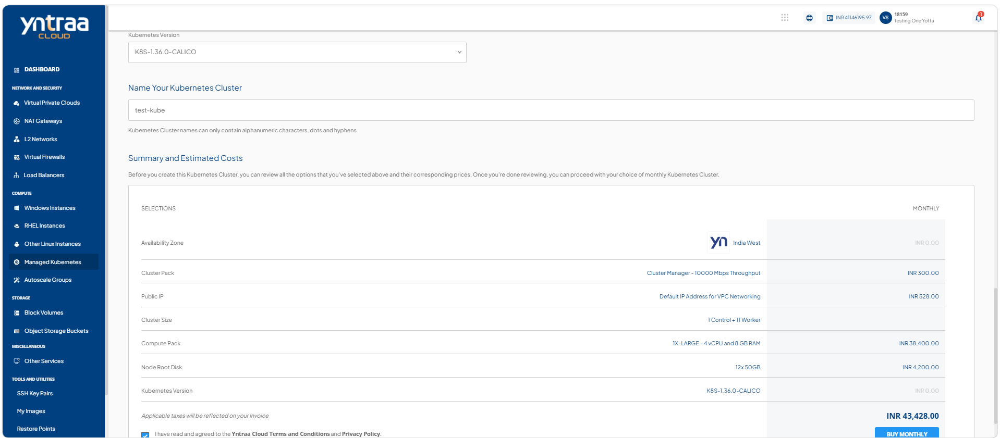

# Creating a Kubernetes Cluster

A Kubernetes cluster is a managed environment for deploying and managing containerized applications. Creating a Kubernetes cluster enables you to automate application deployment, scaling, and management while ensuring high availability, efficient resource utilization, and simplified operations across your cloud environment.

To create a kubernetes cluster, follow these steps:

1. Navigate to **Compute > Managed Kubernetes**. The following screen appears: 
    
2. Click **+ New Kubernetes Cluster**. The following screen appears: 
   
   
   
3. Select availability zone.
   
    :::note
    Kubernetes clusters can be created only in availability zones that support VPC networking
    :::
4. Select a cluster pack from the list.
5. Select the required IP address configuration for the cluster.
6. Select a compute pack from the compute intensive list.
7. Enter the required cluster size to define the number of nodes created in the kubernetes cluster.
8. Enter the required node root disk size for each cluster node.
9. Select a kubernetes version from the dropdown.
10. Enter the kubernetes cluster name in **Name Your Kubernetes Cluster**.
11. Select the **I have read and agreed to the Yntraa Cloud Terms and Conditions and Privacy Policy** option, and click the **Buy Monthly** button. 

