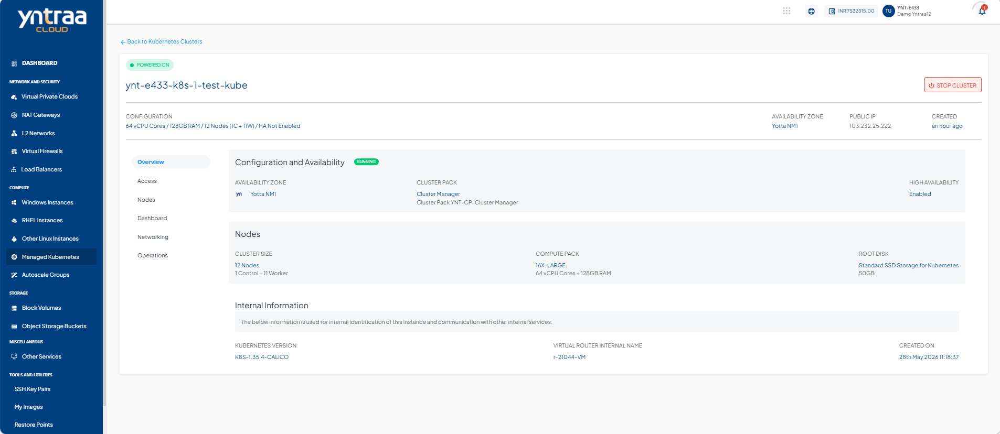
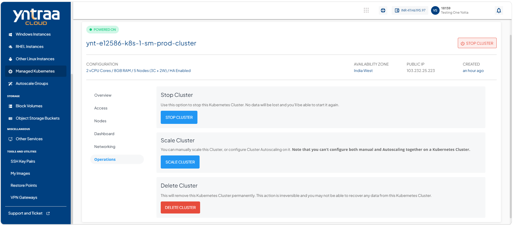
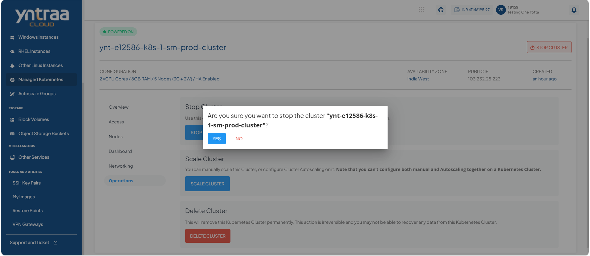
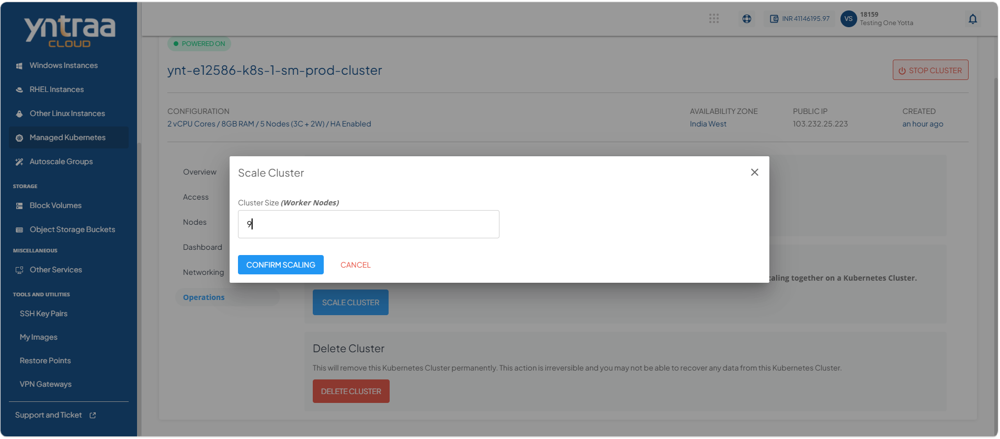
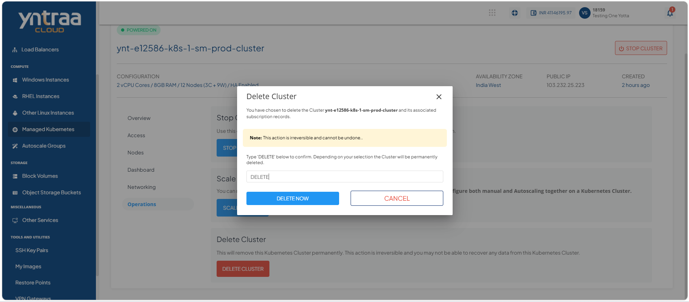

# ManagingKubernetesClusterOperations

Manage Kubernetes cluster operations to control the lifecycle and capacity of your cluster. These operations enable you to stop the cluster for maintenance, scale resources to meet workload demands, and delete the cluster when it is no longer required, helping you efficiently manage your Kubernetes environment.

Yntraa Cloud provides the following operations on kubernetes cluster:

  
- [Stopping a Kubernetes Cluster](#stopping-a-kubernetes-cluster)
- [Scaling a Kubernetes Cluster](#scaling-a-kubernetes-cluster)
- [Deleting a Kubernetes Cluster](#deleting-a-kubernetes-cluster)

## Stopping a Kubernetes Cluster

Stop a Kubernetes cluster to temporarily suspend its operation for maintenance, troubleshooting, or resource management. Stopping the cluster pauses its services and workloads until you start it again.

To stop a kubernetes cluster, follow these steps: 

1. Navigate to **Compute > Managed Kubernetes**. The following screen appears: 
    
2. Click on your created kubernete cluster from the list. The Overview tab opens automatically. The following screen appears with the details: 
   
3. Click **Operations**. The following screen appears: 
   
4. Click the **Stop Cluster** button. The following screen appears: 
   

## Scaling a Kubernetes Cluster

Scale a Kubernetes cluster to adjust its compute capacity based on workload requirements. Scaling helps you increase or decrease the number of worker nodes, ensuring optimal performance, resource utilization, and application availability.

To scale a kubernetes cluster, follow these steps: 

1. Navigate to **Compute > Managed Kubernetes**. The following screen appears: 
    
2. Click on your created kubernete cluster from the list. The Overview tab opens automatically. The following screen appears with the details: 
   
3. Click **Operations**. The following screen appears: 
   
4. Click the **Scale Cluster** button. The following screen appears where you specify the kubernetes cluster size in Cluster Size: 
   
5. Click the **Confirm Scaling** button. 
   
## Deleting a Kubernetes Cluster

Delete a Kubernetes cluster when it is no longer required. Deleting the cluster permanently removes its configuration, worker nodes, and associated resources, helping you free up infrastructure resources and avoid unnecessary costs.

To delete a kubernetes cluster, follow these steps: 

1. Navigate to **Compute > Managed Kubernetes**. The following screen appears: 
    
2. Click on your created kubernete cluster from the list. The Overview tab opens automatically. The following screen appears with the details: 
   
3. Click **Operations**. The following screen appears: 
   
4. Click the **Delete Cluster** button. The following screen appears where you specify the kubernetes cluster size in Cluster Size: 
   
5. Enter **DELETE** and click **Delete** button.
