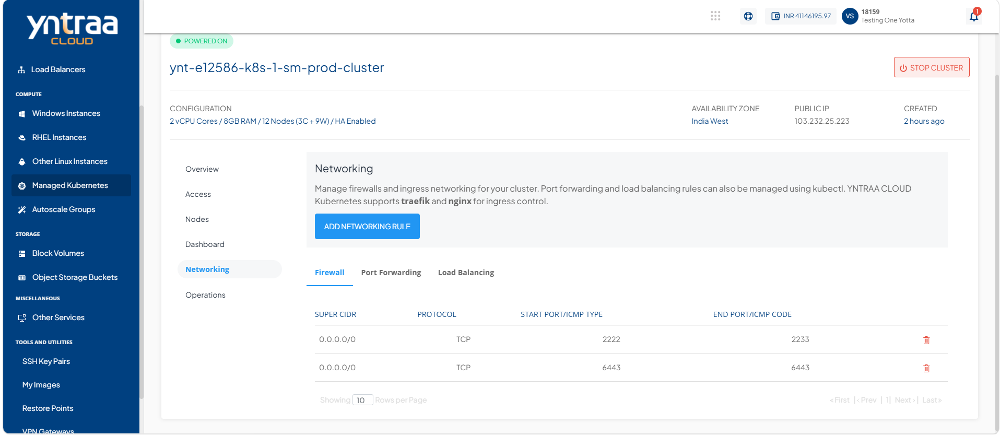
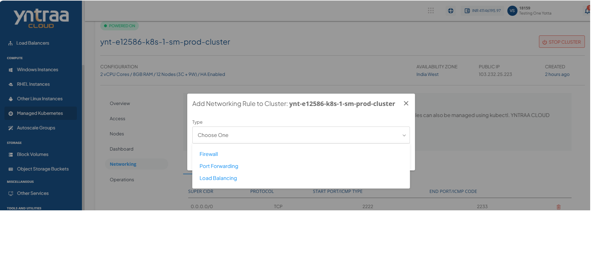
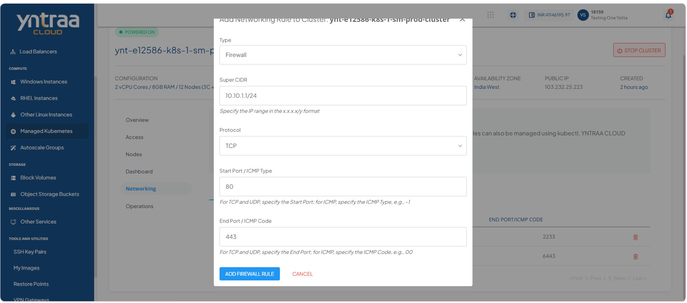
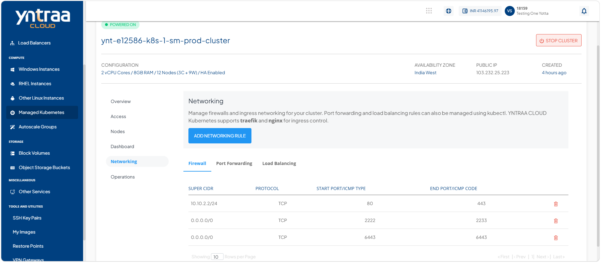
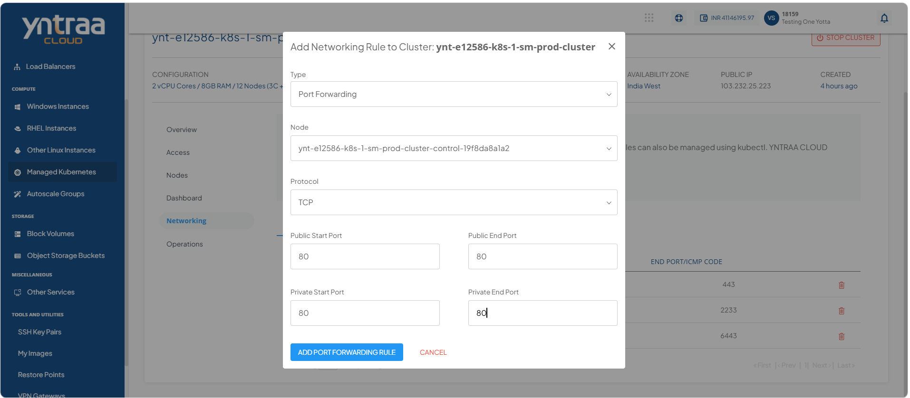
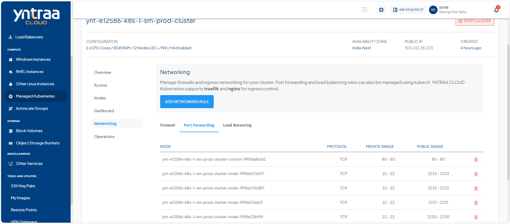
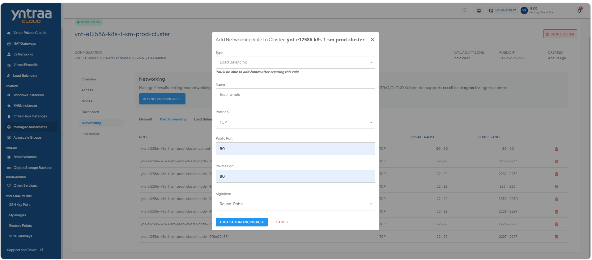

# Managing Networks Rules

Managing network rules enables you to control and regulate network traffic for kubernetes workloads by configuring essential networking rules. It provides options to define firewall rules for traffic filtering, create port forwarding rules for secure access to applications, and configure load balancing rules to distribute incoming traffic across multiple resources. 

These capabilities help ensure secure, reliable, and efficient network communication within the kubernetes environment.
 
## Adding Firewall Rule 

Firewall rules control inbound and outbound network traffic to kubernetes clusters, helping secure applications and services by allowing or denying access based on defined ports, protocols, IP addresses, or network ranges. Adding a firewall rule ensures that only authorized traffic can reach cluster resources while protecting workloads from unauthorized access. 

To add a firewall rule, follow these steps: 
 
1. Navigate to **Compute > Managed Kubernetes**. The following screen appears: 
    
2. Click on your created kubernete cluster name from the list. The Overview tab opens automatically. The following screen appears: 
   
3. Click **Networking**. The following screen appears: 
   
4. Click **Add Networking Rule** button. The following screen appears:
   
5. Click the **Firewall** rule from the dropdown. The following screen appears: 
    
6. Click the **Add Firewall Rule**. The following screen appears:
    
   
## Adding Port Forwarding Rule

Add a port forwarding rule to securely forward traffic from a specified external port to a target port on a kubernetes service or pod. Port forwarding enables temporary access to applications running inside the cluster for testing, debugging, development, or administrative tasks without exposing them publicly.

To add a port forwarding rule, follow these steps: 

1. Navigate to **Compute > Managed Kubernetes**. The following screen appears: 
    
2. Click on your created kubernete cluster name from the list. The Overview tab opens automatically. The following screen appears: 
   
3. Click **Networking**. The following screen appears: 
   
4. Click **Add Networking Rule** button. The following screen appears:
   
5. Click the **Firewall** rule from the dropdown. The following screen appears: 
    
6. Click the **Add Port forwarding Rule** button. The following screen appears: 
    
7. Click the **Port Forwarding** column. The following screen appears: 
   
   
## Adding Load Balance Rule

Add a load balancing rule to distribute incoming network traffic across one or more kubernetes services or application instances. Load balancing improves application availability, scalability, and reliability by ensuring traffic is evenly routed to healthy backend workloads, helping maintain consistent performance and minimize service disruptions.

To add a load balance rule, follow these steps: 

1. Navigate to **Compute > Managed Kubernetes**. The following screen appears: 
    
2. Click on your created kubernete cluster name from the list. The Overview tab opens automatically. The following screen appears: 
   
3. Click **Networking**. The following screen appears: 
   
4. Click **Add Networking Rule** button. The following screen appears:
   
5. Click the **Load Balancing Rule** rule from the dropdown. The following screen appears: 
    
6. Click the **Add Port Forwarding Rule** button. The following screen appears:
  