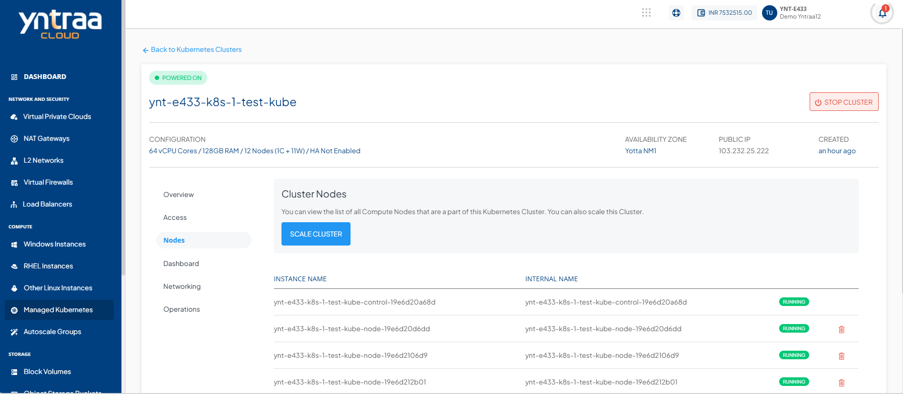
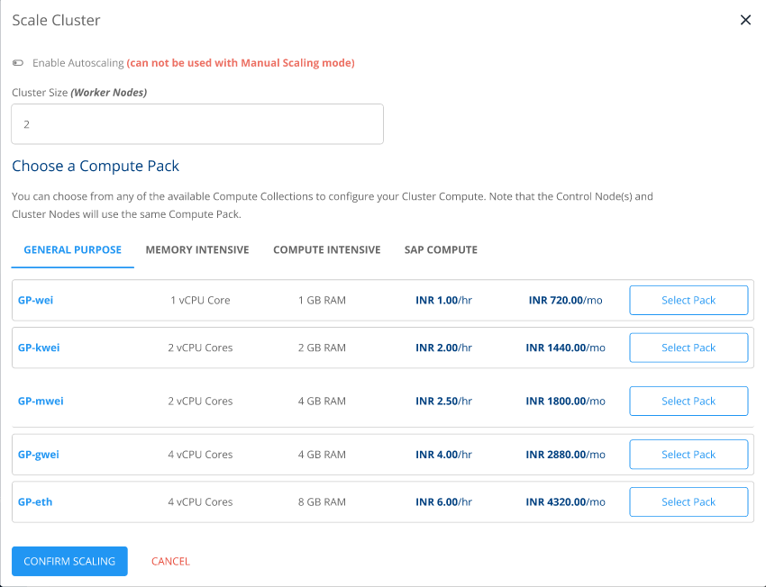
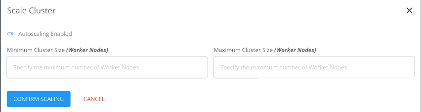

# Scaling Kubernetes Clusters

Yntraa Cloud allows for manual and automatic cluster scaling. You can configure cluster scaling from the **Nodes** section of cluster details or from the **Operations** section of cluster details.
## Manually Scaling a Cluster
1. Navigate to **Operations > Nodes**, click the **SCALE CLUSTER** button. 
	A window appears where you must keep **Autoscaling** disabled.
2. Select one of the available compute packs.
3. Click **CONFIRM SCALING**.
## Automatically Scaling a Cluster
1. Navigate to **Operations > Nodes**.
2. Click the **SCALE CLUSTER** button. A window appears, where you must enable **Autoscaling**.
3. Enter the minimum and maximum number of worker nodes.
4. Click **CONFIRM SCALING**.

:::note
If the Scale operation fails, stop the cluster and retry the process.
:::