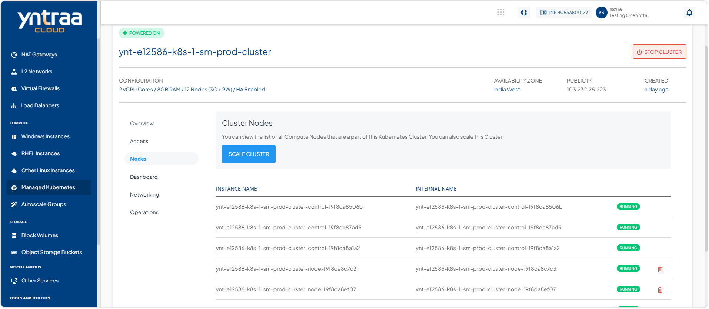
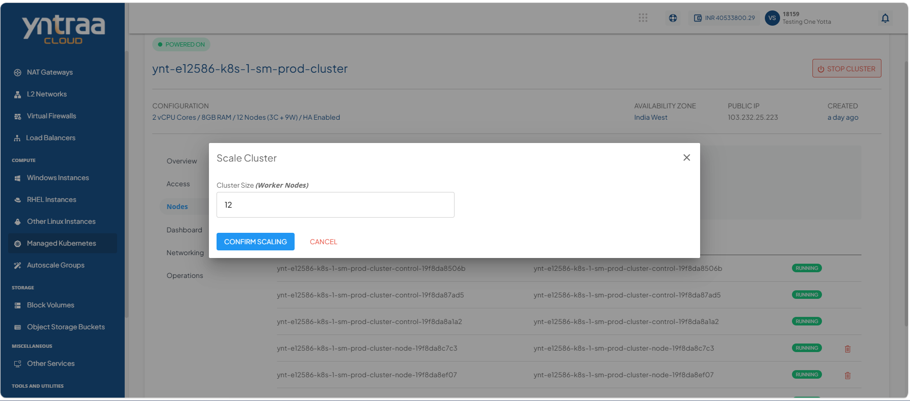

# Scaling Kubernetes Clusters

Scaling a Kubernetes cluster allows you to adjust its compute capacity by increasing or decreasing the number of worker nodes based on workload demands. This helps maintain application performance, optimize resource utilization, and ensure high availability while efficiently managing infrastructure costs.

1. Navigate to **Compute > Managed Kubernetes**. The following screen appears: 
    
2. Click on your created kubernete cluster name from the list. The Overview tab opens automatically. The following screen appears: 
   
3. Click **Nodes**. The following screen appears: 
   
4. Click the **Scale Cluster** button. The following screen appears where you enter the cluster size: 
   
5. Click the **Confirm Scaling** button.