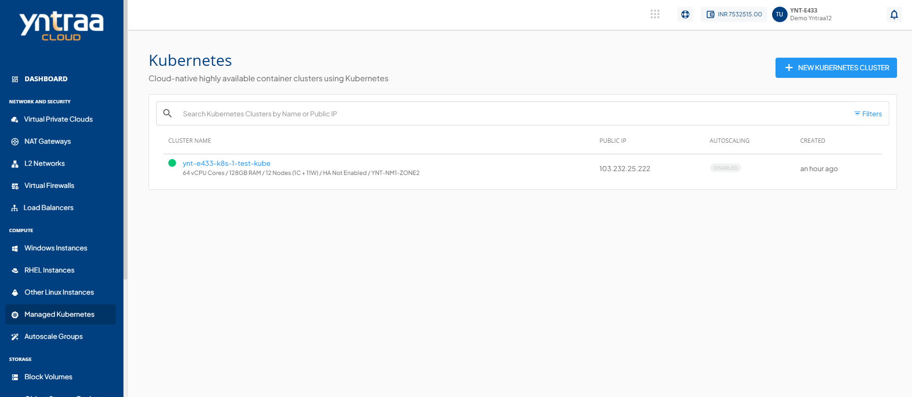

# Viewing Kubernetes Cluster Details

Yntraa Cloud offers a detailed view of Kubernetes clusters on the UI. Yntraa Cloud also brings the full power and accessibility of cluster management via the `kubectl` interface.

To view cluster details on the UI, follow these steps:

1. Navigate to **Compute > Kubernetes**. All the Kubernetes clusters for your account will be listed here with the following details.
    - Kubernetes Cluster Name (Along with the configuration details)
    - Public IP address
    - Autoscaling Enabled/Disabled
    - Created
      
	
2. Click the Kubernetes cluster name. The following details appear: 
	   - Configuration
	   - Availability Zone
	   - Cluster Pack
	   - High Availability Enabled/Disabled
	   - A button the top right corner to  **Stop Cluster/Start Cluster**.
	   - A list of sections and the various operations you can perform.

The details on available Kubernetes Cluster operations and actions can be found in their respective sections:
- [Overview](docs/Subscribers/Compute/ManagedKubernetes/Overview.md)
- [Access](AccessingaClusterusingtheCommandLine.md)
- [Nodes](ScalingKubernetesClusters.md)
- [Dashboard](AboutKubernetesDashboard.md)
- [Networking](IngressNetworkingonKubernetesClusters.md)
- [Operations](ClusterOperations)