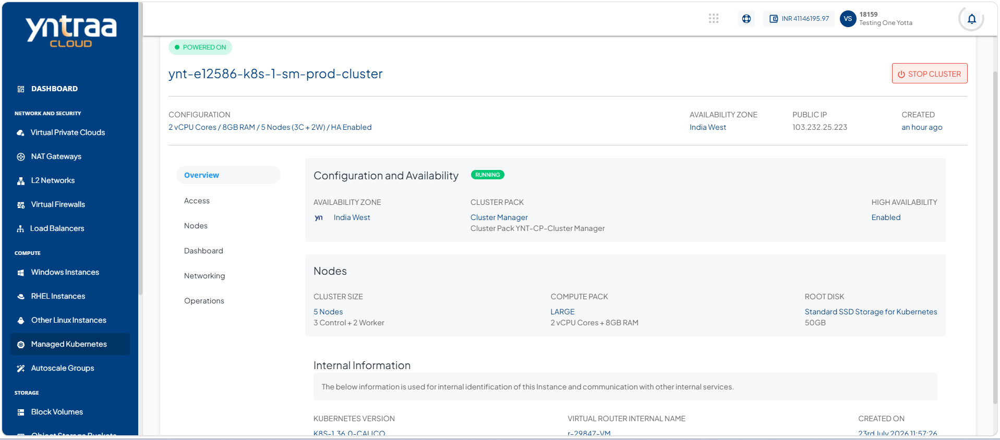
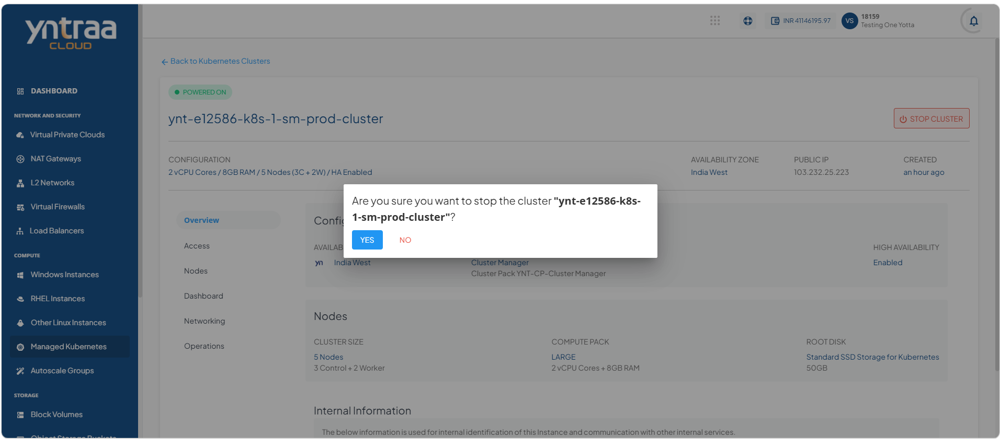
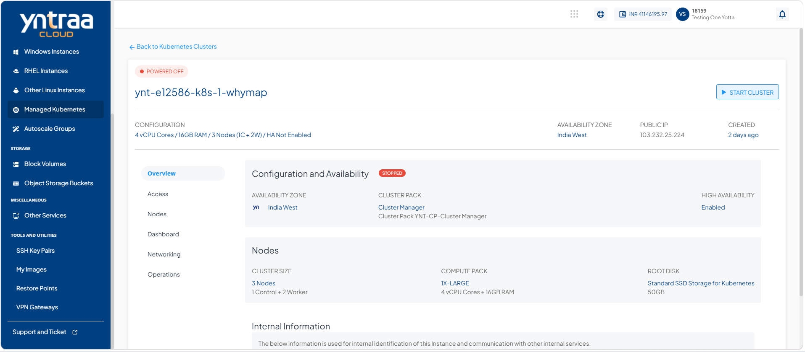
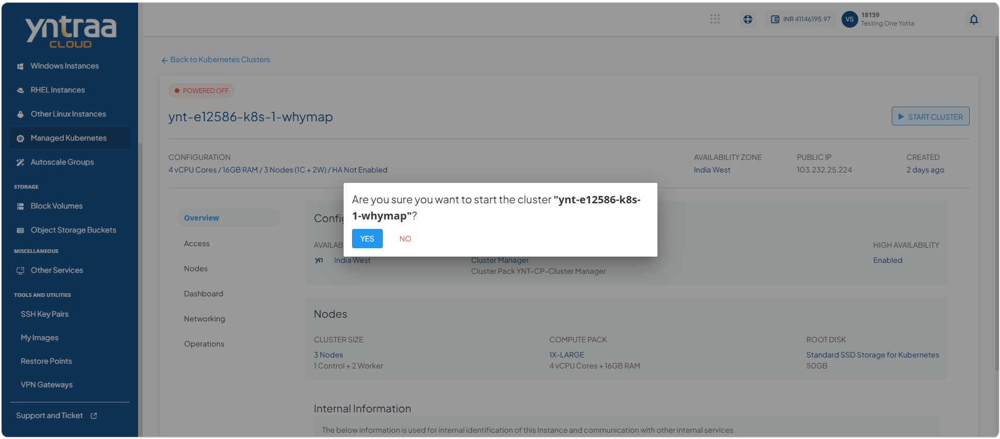

# Viewing Kubernetes Cluster Details

View the kubernetes cluster details to access comprehensive information about the cluster, including its configuration, node information, networking, and current status. Reviewing these details helps you monitor cluster health, verify settings, and troubleshoot issues effectively.

To view the details of a kubernetes cluster, follow these steps:

1. Navigate to **Compute > Managed Kubernetes**. The following screen appears: 
    
2. Click on your created kubernete cluster name from the list. The Overview tab opens automatically. The following screen appears with the details: 
   
   
**Configuration and Availability:** This displays the following kubernetes cluster configuration details to help verify its current configuration and operational state:

- The instance's status **Running** or **Stopped**
- Availability Zone
- Cluster Pack
- High Availability

**Nodes:** This displays the following information about the worker nodes associated with the kubernetes cluster, helping you monitor node health, capacity, and overall cluster status:
- Template Name
- Created On

**Internal Information:** This displays the following information that is used for internal identification of the kubernetes cluster and communication with other internal services:
- Kubernetes Version
- Virtual Router Internal Name
- Created On
      
## Stopping and Starting a Kubernetes Cluster

Stop and start a kubernetes cluster to perform maintenance, troubleshoot issues, or manage resource usage. Stopping the cluster temporarily suspends its operation, while starting it restores the cluster and its services, allowing your containerized workloads to resume normal operation.

To stop and start a kubernetes cluster, follow these steps:  

1. Navigate to **Compute > Managed Kubernetes**. The following screen appears: 
    
2. Click on your created kubernete cluster name from the list. The Overview tab opens automatically. The following screen appears: 
   
3. Click the Stop Cluster button. The following screen appears: 
   
4. Click the **Yes** button. The following screen appears:
   
5. Click the Start Cluster button. The following screen appears: 
   
6. Click the **Yes** button. The following screen appears:
   

   
  
