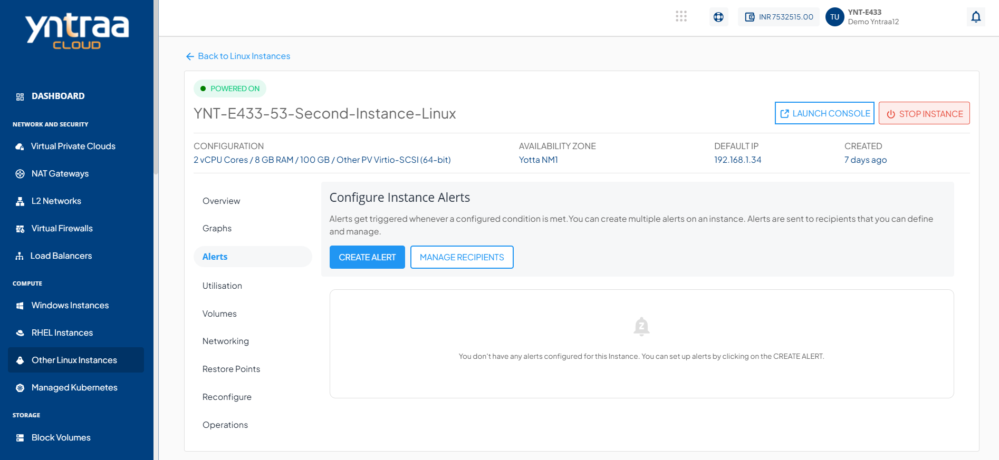
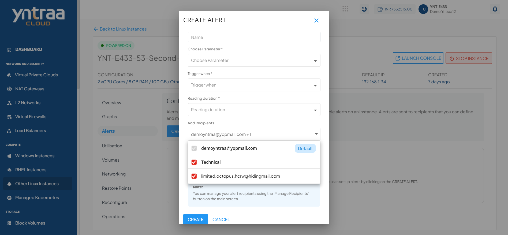
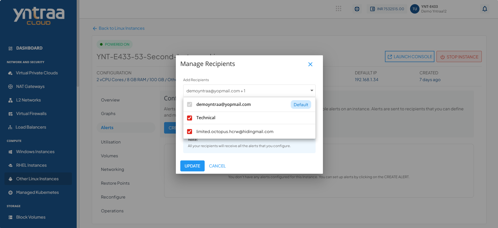

# Creating Alerts

Alerts get triggered whenever a configured condition is met. You can create multiple alerts on an instance. Alerts are sent to recipients that you can define and manage.

You can configure alerts for instances running on the Yntraa Cloud. You can define alerts for Instances and configure the email recipients for these alerts using a straightforward and easy-to-use interface.

To view the configured alerts or configure new ones, navigate to the [Operating Linux Instances](AboutLinuxInstances.md), and select Linux Instance and access the **Alerts** tab.
## Instance Alerts

The Alerts tab lists all the alerts already configured for that particular Linux Instance. In addition, it shows the following details:
- Alert Name
- Parameter
- Trigger
- Value
- Reading Duration

## Creating an Alert

To create or add alerts, follow these steps:

1. Click the **Create Alert** button. The following window appears:

 screenshot change
2. Provide the information in the following fields:
- **Name** - You can define the name for your alert.
- **Choose Parameter** - This option allows you to define what parameter needs to be monitored to trigger the alert email. Yntraa Cloud supports CPU, RAM, NETWORK INPUT and NETWORK OUTPUT parameters.
- **Trigger when** - This set of options lets you define whether to trigger above or below a custom value.
- **Reading duration** - Select the duration for which the condition must persist before triggering the alert.
- **Add Recipients** - Email IDs can be added here, or also you can add them by using the manage recipients.
3. Click **Create**.
## Managing Recipients

This section list and display all the recipients' IDs already configured for the alerts. You can delete the existing email IDs and add other email IDs. To do so, perform the following steps:

1. Click the **MANAGE RECIPIENTS** button.
2. Use the dropdown menu to select available recipients.
   
3. Click the **UPDATE** button to save the recipient list.

:::note
All recipients receive all setup alerts. If no email ID added, then no email is sent for the alerts.
:::

