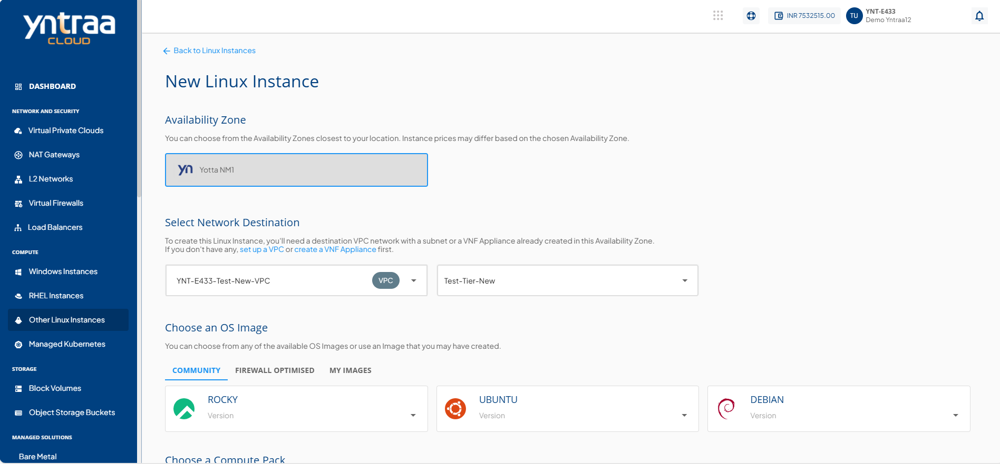
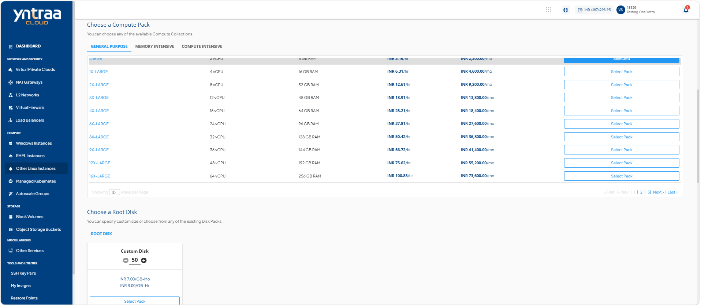
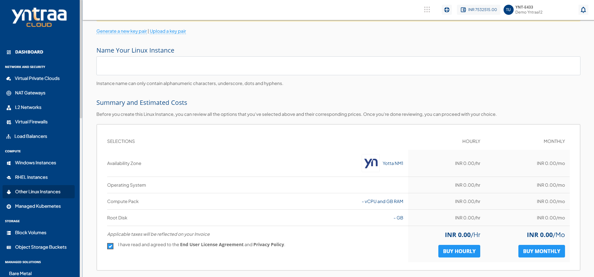
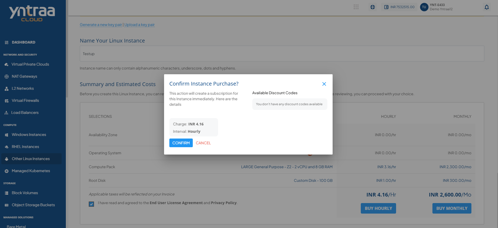

# Creating Linux Instances

Create a  Linux instance to deploy a instance for running Linux-based applications and workloads in the cloud. During creation, you configure the required compute, storage, networking, and other settings to provision an instance that meets your workload requirements.

To create a Linux instance, follow these steps:

1. Navigate to **Compute > Other Linux Instances**. The following screen appears:
   
2. Click the **New Linux Instance** button. The following screen appears: 
   
   
   
3. Select Availability Zone, which is the geographical region where your Instance deploys.
4. Select a VPC or VNF network from the **Select Network Destination** dropdown, and select the appropriate tier listed in network.
	:::note
	To add a Linux instance to a VPC or VNF, you must have a VPC or VNF configured with at least one tier.
	:::
5. Select the OS Image to run on your Instance.
6. Navigate to **Choose an OS Image >** [MY IMAGES](/docs/Subscribers/ToolsandUtilities/ManagingCustomTemplatesandImages), and select an image.
7. Select the compute pack from the list.
8. Select a **Root Disk** for your instance from the available options or choose **Custom Disk** to define the size. Adjust the disk size as required, and click **Select Pack** to confirm.
9. **Choose an Authentication Method**:
    - **Use SSH key pair**: To view all the SSH key pairs present in your account, click the **Use SSH key pair** option. If your account doesn’t have any SSH key pair, then you can click the **Generate a new key pair** or upload the key pair by clicking the **Upload a key pair** option. 
    - **Use Default Password**: On selecting **Use Default Password**, the system automatically generates a password for the instance. You can view or copy this password from the instance details page after creation and use it to log in.
    - **Use Custom Password**: On selecting **Use Custom Password**, you are required to enter and confirm your own password. This password is used to access the instance after it is created. Ensure the password meets the required security criteria.
10. Enter the name for your Linux instance in **Name Your Linux Instance**.
11. Select the **I have read and agreed to the End User License Agreement and Privacy Policy** option, and then click **Buy Hourly** or **Buy Monthly** button. The following screen appears:
   
12. Click the **Confirm** button. The Linux Instance is created.

