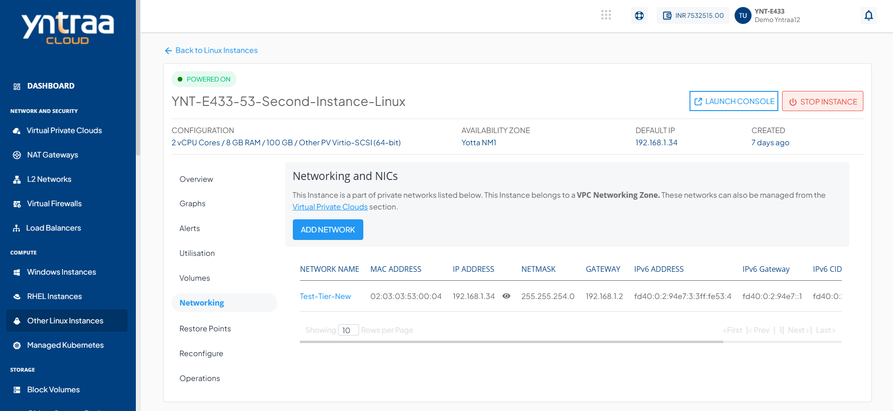
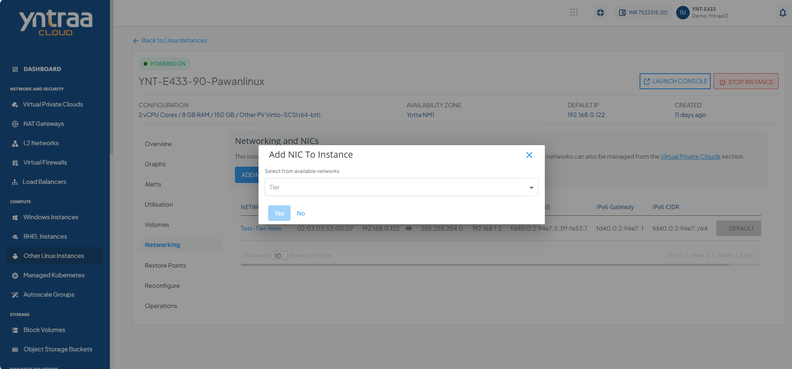
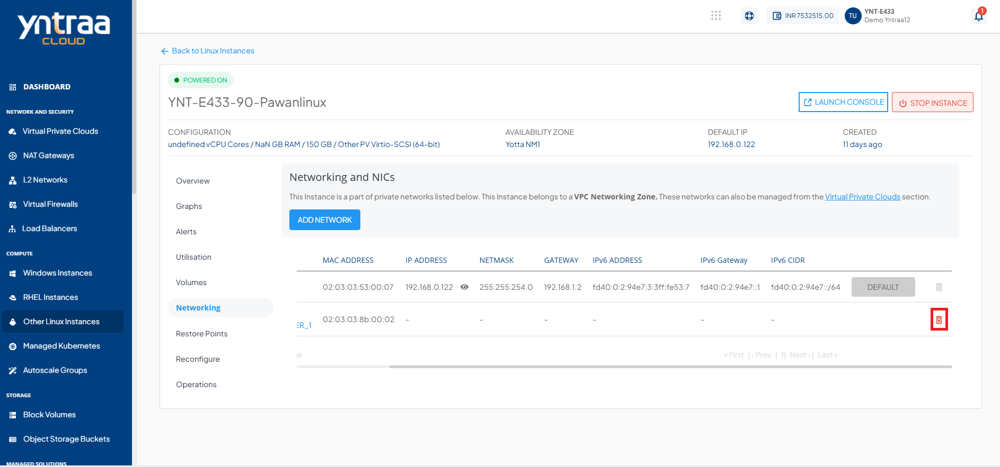

# Networking Management

To view the networks of particular Instance:
1. Navigate to **Compute** > [Other Linux Instances](AboutLinuxInstances.md).
2. Select a Linux Instance and access the **Networking** tab. The following screen appears:

3. Click the **Add network** button. The following screen appears:
   
4. In the **Add NIC To Instance**:
    - Click on the dropdown under **Select from available networks**.
    - Choose the desired network from the list of available networks.
5. After selecting the network, click **Yes** to attach the NIC to the instance.
   
:::note
If the Instance is inside a VPC, you can associate the Instance to multiple tiers within the VPC or share the Instance with other VPC networks in the same Availability Zone by using the **Add Network**.
:::

6. Network/tier associations can be removed from this section by using the **Delete NIC** action.
   

:::note
Advanced networking configurations can be done using the Virtual Private Clouds service.
:::

