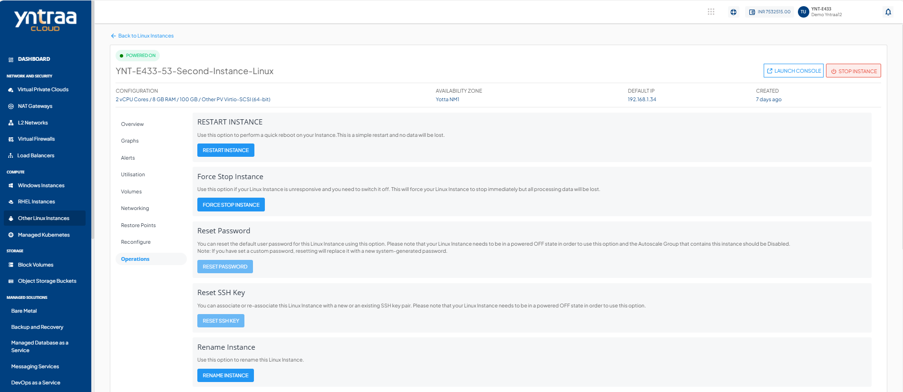
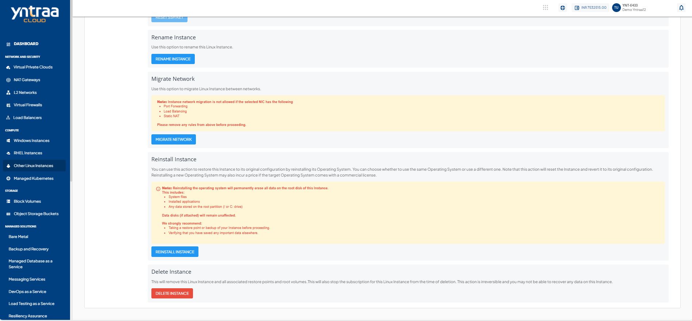

# Operations

 To view all available Instance operations, follow these steps
 1. Navigate to the **Compute** > [Other Linux Instances](AboutLinuxInstances.md)
 2. Select a Linux Instance and access the **Operations** tab. The following screen appears:
 
 

Yntraa Cloud provides the options to perform the following operations on Linux Instances:

- **Restart Instance** - Perform a quick reboot on your Instance. This is a simple restart, and no data is lost.
- **Force Stop Instance** - Force stop a running or a hung Linux Instance.
- **Reset Password** - Reset the Linux Instances root user password. This requires the Linux Instance to be powered off.
- **Reset SSH KEY** - Reset the Linux Instances SSH key association. This requires the Linux Instance to be powered off.
- **Rename Instance** - Rename the Linux Instance.
- **Migrate Instance** - Migrate Linux Instance between VPC networks within the same Availability Zone.
    :::note
    Instance network migration is not permitted if the selected NIC has Port Forwarding, Load Balancing, or Static NAT configured. Remove these configurations before proceeding.
    :::

- **Reinstall Instance** - Restore this Instance to its original configuration by reinstalling its Operating System or choosing a new one. Choosing a new Operating System image may have an additional billing component if it is a priced Operating System.
  :::note
  Reinstalling the operating system will permanently erase all data on the root disk (including system files, applications, and stored data). Attached data disks remain unaffected. Ensure back up important data before proceeding.
  :::
  
- **Delete Instance** - Delete the Linux Instance.   
  :::warning
  Deleting a Linux Instance removes it entirely along with its subscription and is a non-reversible action.
  :::

