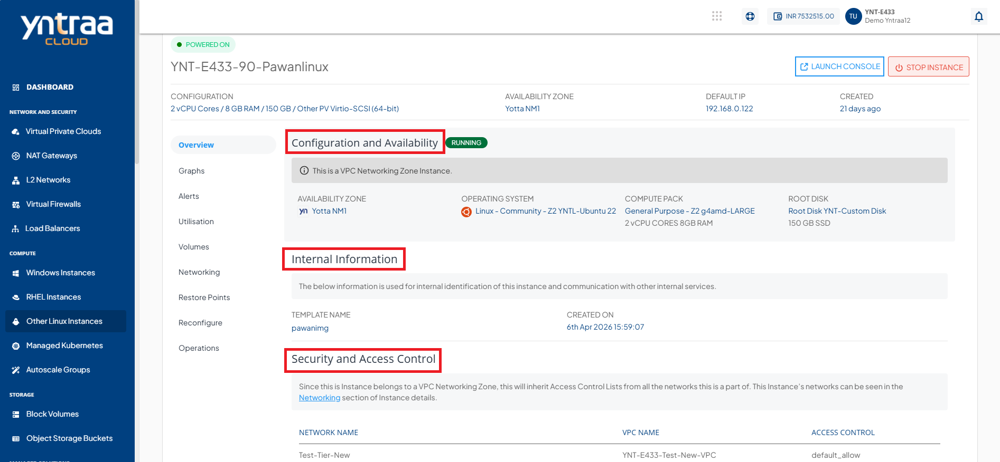
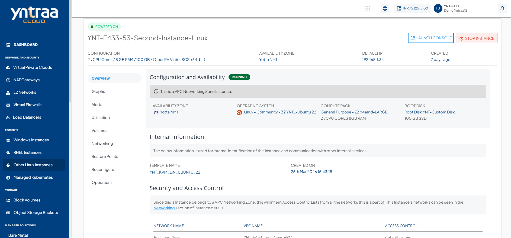
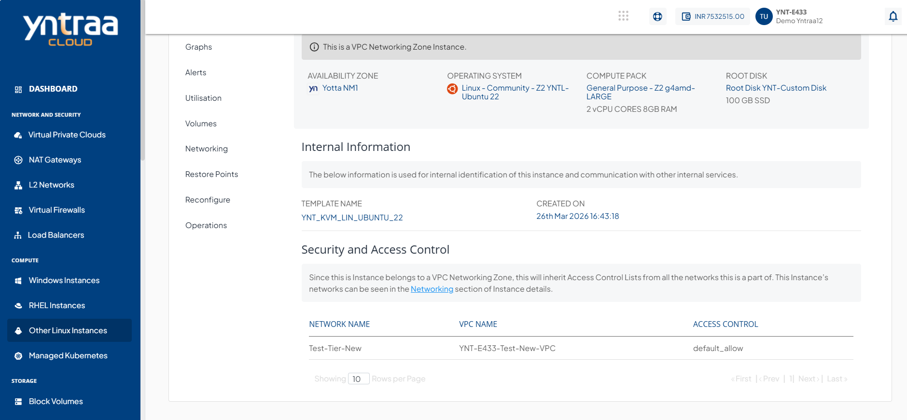

# Overview

Navigate to Compute > [Other Linux Instances](AboutLinuxInstances.md), click **Instance Name**, and select the **Overview** tab. 

The following detail appears:

- [Configuration and Availability](#configuration-and-availability)
- [Internal Information](#internal-information)
- [Security and Access Control](#security-and-access-control)
## Configuration and Availability

This section displays the instance's status, **Running** in green, and other information related to the networking zone in red.

## Internal Information
This section displays the information used for internal identification of this instance and communication with other internal services:
- Template Name
- Created On

## Security and Access Control
This section displays the following information:
- Network Name
- VPC Name
- Access Control

