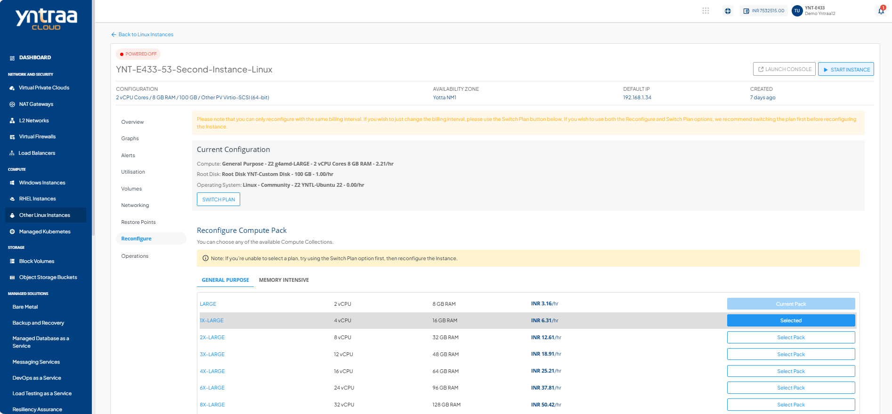
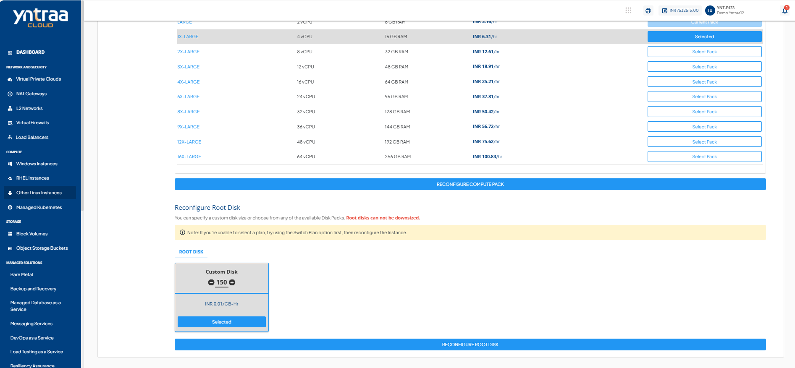

# Reconfiguring Linux Instances

To view a available reconfiguration options:
1. Navigate to  [Other Linux Instances](AboutLinuxInstances.md). The following screen appears:
   
2. Select a Linux Instance and access the **Reconfigure** tab.

You can reconfigure a Linux Instance on Yntraa Cloud in the following ways:

- Billing interval changed between monthly and hourly.
- Choosing and applying a new Compute pack.
- Choosing and applying a new Root Disk pack.

:::note
You can only reconfigure with the same billing interval. To change the billing interval, use the **Switch Plan** button. It is recommended to switch the plan before reconfiguring the Instance if you wish to use both the Reconfigure and Switch Plan options. You are charged as per the pack you have reconfigured, not based on the older pack.
:::

