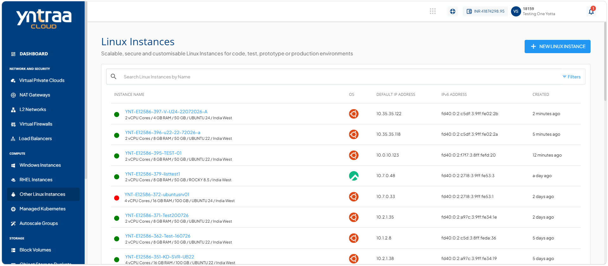
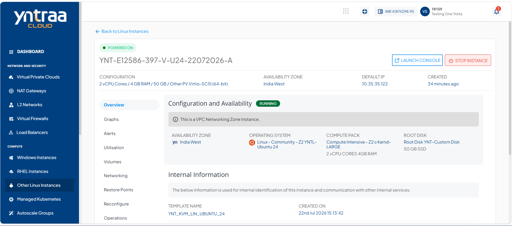
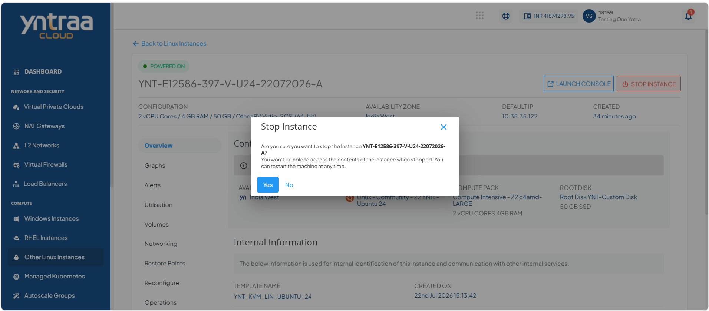
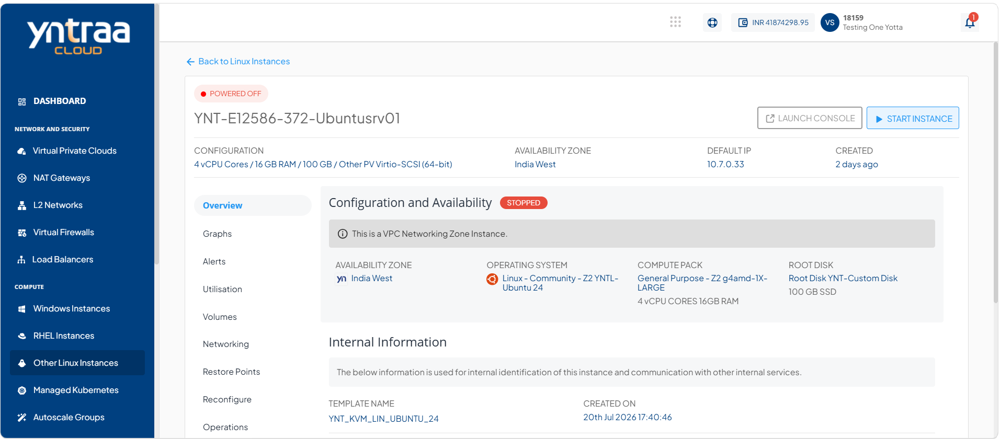
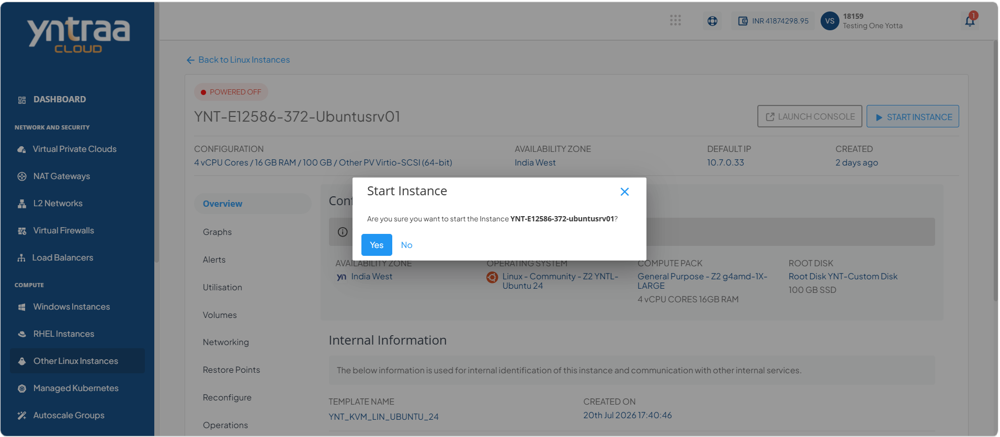

# Viewing Details of Linux Instances

View detailed information about a Linux instance, including its configuration, status, networking, storage, and resource allocation. Reviewing these details helps you monitor the instance and verify its settings for effective management.

This section comprises of the following sub-sections:

  
- [Launching Linux Instance Web Based Console](#launching-linux-instance-web-based-console)
- [Stopping and Starting a Linux Instance](#stopping-and-starting-a-linux-instance)

To view the details of Linux instances, follow these steps:

1. Navigate to **Compute > Other Linux Instances**. The following screen appears: 
   
2. Click on your created Linux instance name from the list. The Overview tab opens automatically. The following screen appears with the details: 
   

- **Configuration and Availability:** This displays the following Linux instance configuration details to help verify its current configuration and operational state:
	- The instance's status **Running** or **Stopped**
	- Availability Zone
	- Operating System
	- Compute Pack
	- Root Disk

- **Internal Information:** This displays the following information that is used for internal identification of the Linux instances and communication with other internal services:
	- Template Name
	- Created On

- **Security and Access Control:** This displays the following available security settings and access control options for the Linux instance based on its networking zone. The available information and operations may vary depending on the configured network environment:
	- Network Name
	- VPC Name
	- Access Control

## Launching Linux Instance Web Based Console 

Launch the Linux instance web-based console to access and manage your Linux instance through a web browser. The console provides a convenient way to perform administrative and management tasks on the instance.

To launch Linux instance web based console, follow these steps:  

1. Navigate to **Compute > Other Linux Instances**. The following screen appears: 
   
2. Click on your created Linux instance name from the list. The Overview tab opens automatically. The following screen appears: 
   
3. Click **Launch Console** button, and then provide the Linux credentials to login and access the Linux instance web-based console.
   
## Stopping and Starting a Linux Instance

Stop a Linux instance to temporarily shut it down when it is not in use, helping optimize resource usage. Start the instance whenever you need to restore access and resume running your Linux-based applications and workloads.

To stop and start the Linux instance, follow these steps:  

1. Navigate to the **Compute > Other Linux Instances**. The following screen appears: 
   
2. Click on your created Linux instance name from the list. The Overview tab opens automatically. The following screen appears: 
   
3. Click the Stop Instance button. The following screen appears: 
   
4. Click the **Yes** button. The following screen appears:
   
5. Click the Start Instance button. The following screen appears: 
   
6. Click the **Yes** button. The following screen appears:
   
