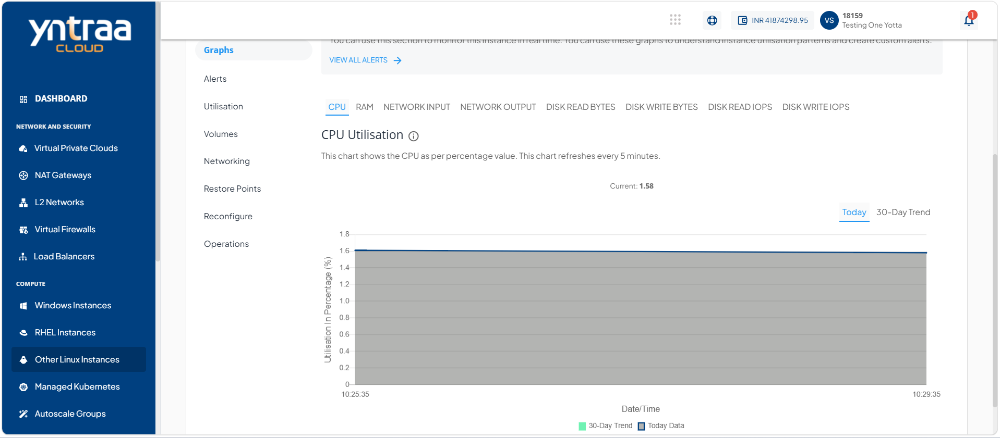

# Viewing Graphs 

Graphs provide a visual representation of the performance and resource utilization of your linux instance. You can monitor key metrics such as CPU, memory, network traffic, and disk activity over time to track usage patterns, identify performance trends, and help ensure the instance operates efficiently.

To view graphs, follow these steps: 

1. Navigate to **Compute > Other Linux Instances**. The following screen appears:
   
2. Click on your created linux instance from the list. The Overview tab opens automatically. The following screen appears with the details: 
   
3. Click **Graphs**. The following screen appears: 
   

